# 州立农业保险公司 (State Farm Insurance) —— 全美第一大财产险巨头与相互制金融帝国全景介绍

> **《财富》世界500强排名：第 70 位**  
> **年度营业收入：$132,312 百万美元（约 1323.1 亿美元）**  
> **官方网站：[www.statefarm.com](https://www.statefarm.com)**

---

## 🏢 企业基本信息 (Corporate Snapshot)

| 维度 | 详细信息 |
| :--- | :--- |
| **公司全称** | 州立农业互助汽车保险公司 (State Farm Mutual Automobile Insurance Company) |
| **成立时间** | 1922 年 6 月 7 日 (创立于美国伊利诺伊州布卢明顿) |
| **全球总部** | 🇺🇸 美国 伊利诺伊州 布卢明顿 (Bloomington, IL) |
| **创始人** | 乔治·J·梅切尔 (George Jacob Mecherle) |
| **现任董事长** | 迈克尔·L·蒂普索德 (Michael L. Tipsord) |
| **现任 CEO** | 乔恩·法尼 (Jon Farney) |
| **公司体制** | **相互保险公司 (Mutual Company)** —— 资产归全体保单持有人共同所有，非上市公司 |
| **全球员工总数** | 约 53,000+ 名内勤员工，以及 **19,000+ 名专属特许独立代理人** |
| **有效保单规模** | 管理全美逾 **8,500 万份** 有效汽车、房屋、商业及人寿保单 |
| **核心业务赛道** | 个人及商用车险 (全美市占率第一)、房屋家财险 (全美第一)、人寿与年金保险、健康险与社区银行业务 |

---

## 🌐 核心业务矩阵与全美版图 (Business Architecture)

```mermaid
graph TD
    SF["州立农业保险商业帝国 (State Farm)"]
    
    SF --> AUTO["1. 汽车保险业务 (Auto Insurance, 连续80+年全美第一)"]
    AUTO --> AUTO1["全美私人乘用车险 (超 4500 万份活跃车险保单)"]
    AUTO --> AUTO2["商业车队与重型货车运输保险"]
    AUTO --> AUTO3["Drive Safe & Save (车联网 UBI 动态行为费率折扣)"]
    
    SF --> HOME["2. 房屋与财产保险 (Fire & Property, 全美第一)"]
    HOME --> HOME1["全美自住房房主综合险 (Homeowners Policy)"]
    HOME --> HOME2["租房客险、公寓险与农场全险 (Farm Ranch)"]
    HOME --> HOME3["洪水、飓风与极端气象灾害巨灾保险"]
    
    SF --> LIFE["3. 人寿健康与财富管理 (Life, Health & Wealth)"]
    LIFE --> LIFE1["定期寿险、终身寿险与高额万能寿险"]
    LIFE --> LIFE2["伤残失能险与补充医疗险"]
    LIFE --> LIFE3["State Farm 共同基金与 529 大学教育储蓄计划"]
    
    SF --> AGENT["4. 超级专属代理人网络 (19,000+ Captive Agents)"]
    AGENT --> AGENT1["遍布全美各大城市社区与偏远乡镇的专属独立网点"]
    AGENT --> AGENT2["深度扎根社区的‘好邻居’终身家庭顾问生态"]

    classDef main fill:#d81e05,stroke:#000,stroke-width:2px,color:#fff;
    classDef branch fill:#222,stroke:#d81e05,stroke-width:1px,color:#fff;
    classDef sub fill:#fff5f5,stroke:#d81e05,stroke-width:1px,color:#000;
    class SF main;
    class AUTO,HOME,LIFE,AGENT branch;
    class AUTO1,AUTO2,AUTO3,HOME1,HOME2,HOME3,LIFE1,LIFE2,LIFE3,AGENT1,AGENT2 sub;
```

---

## ⚡ 核心竞争壁垒与护城河 (Strategic Moats)

### 1. 独步全美的专属特许代理人网络 (19,000+ Captive Agents)
- 与依赖第三方独立中介商（Independent Brokers）的竞争对手不同，State Farm 拥有全美规模最庞大、忠诚度最高的 **19,000 多名专属独家代理人**。
- 每一个代理人都是当地社区的名人与信赖枢纽，他们只销售 State Farm 的产品，形成了极高黏性与跨越数代人的家庭保单复购护城河。

### 2. 纯粹的相互制公司架构 (Mutual Structure)
- State Farm 没有华尔街股票代码，无需向追逐短期季度财报利润的外部股东负责。其全部盈余资产（净资产盈余超 1300 亿美元）归全体保单持有人共同享有。
- 这使其能够在通胀或巨灾年份从容吸收承保亏损，并在行业复苏时将超额利润通过保费折扣或分红返还给车主，保持行业最顶级的客户保留率。

### 3. 连续 80 多年全美车险第一的绝对规模经济
- 庞大的理赔数据库让 State Farm 拥有全行业最精准的精算定价模型与全美数万家汽车碰撞维修厂的极强议价能力，其单笔理赔成本显著低于行业平均水平。

### 4. 经典文化心智护城河：“像个好邻居 (Like a good neighbor)”
- 伴随着家喻户晓的品牌金句与广告歌曲，State Farm 在全美消费者心智中已不仅仅是一家金融公司，而是深入人心的“邻里守望相助”图腾。

---

## 📈 历史关键里程碑 (Historical Milestones)

- **1922年6月7日**：伊利诺伊州农夫乔治·J·梅切尔在布卢明顿创办**州立农业互助汽车保险公司 (State Farm Mutual Automobile Insurance Company)**。
- **1928年**：启动全美跨州扩张，在加利福尼亚州设立首个州外区域分公司。
- **1929年**：创立州立农业人寿保险公司 (State Farm Life Insurance Company)。
- **1935年**：创立州立农业火灾与财产保险公司 (State Farm Fire and Casualty Company)。
- **1942年**：State Farm 承保汽车数量跃居全美第一，历史性登上全美汽车保险霸主宝座（此后连续 80 余年从未旁落）。
- **1951年**：创始人梅切尔逝世，其子阿德莱·梅切尔接任董事长，继续推行平价互助扩张。
- **1971年**：由著名音乐人巴瑞·曼尼洛谱曲的品牌口号 **“Like a good neighbor, State Farm is there (像个好邻居，州立农业常伴左右)”** 传唱全美。
- **2020年代**：全面普及车联网智能终端“Drive Safe & Save”与移动端 AI 极速拍照定损理赔体系。
- **2024-2026年**：年营业收入跨越 1320 亿美元，有效保单突破 8500 万份，稳居《财富》世界500强第 70 位。

---

## 🎯 企业文化与价值观 (The Good Neighbor Spirit)

State Farm 恪守 **“帮助人们管理日常风险、从未知意外中恢复、实现美好梦想”** 的使命：

1. **好邻居精神 (Being a Good Neighbor)**：以同理心、诚信与真诚关爱每一位社区居民。
2. **恪守诚信与品质 (Integrity & Quality)**：对每一笔理赔兑现毫不妥协的守诺与高效服务。
3. **相互关怀与共享 (Mutuality)**：始终维护保单持有人的长期利益高于一切。
