# 法国电力公司 (Électricité de France, EDF) —— 全球低碳核能发电与欧洲能源主权巨头全景介绍

> **《财富》世界500强排名：第 74 位**  
> **年度营业收入：$127,754 百万美元（约 1277.5 亿美元）**  
> **官方网站：[www.edf.fr](https://www.edf.fr)**

---

## 🏢 企业基本信息 (Corporate Snapshot)

| 维度 | 详细信息 |
| :--- | :--- |
| **公司全称** | 法国电力公司 (Électricité de France S.A. / 简称 EDF) |
| **成立时间** | 1946 年 4 月 8 日 (由法兰西共和国临时政府通过电力国有化法案设立) |
| **全球总部** | 🇫🇷 法国 巴黎 (22-30 Avenue de Wagram, 75008 Paris, France) |
| **奠基背景** | 二战后戴高乐政府主导，由工业部长马塞尔·保罗推动将全法近 1,450 家私营电力与燃气企业整合归公 |
| **现任 CEO / 董事长** | 吕克·雷蒙 (Luc Rémont, 董事长兼首席执行官) |
| **企业性质** | 法国政府 100% 全资控股国有企业 (2023年完成完全再国有化并从巴黎泛欧交易所退市) |
| **全球员工总数** | 约 170,000+ 人（涵盖核物理学家、核反应堆工程师、电网调度专家与可再生能源研发人员） |
| **核心业务赛道** | 核能发电运营 (56座在役商用压水堆)、水力发电与海上风电/光伏 (EDF Renouvelables)、输配电网运营 (Enedis/RTE)、欧洲跨境电力贸易与综合能效服务 (Dalkia) |

---

## 🌐 核心业务矩阵与商业版图 (Business Ecosystem)

```mermaid
graph TD
    EDF["法国电力集团 (EDF Group)"]
    
    EDF --> NUC["1. 核能发电与燃料闭环 (Nuclear Power & Fleet)"]
    NUC --> NUC1["56座在役压水堆机组 (900MW / 1300MW / 1450MW / EPR)"]
    NUC --> NUC2["大修与延寿工程 (Grand Carénage 计划)"]
    NUC --> NUC3["新一代 EPR2 压水堆与 Nuward 小型模块堆 (SMR)"]
    NUC --> NUC4["Framatome 法马通反应堆设计与燃料制造"]
    
    EDF --> REN["2. 可再生能源与水利 (Renewables & Hydro)"]
    REN --> REN1["法国本土水力发电梯级枢纽 (Hydroelectric Fleet)"]
    REN --> REN2["EDF Renouvelables 全球海上/陆上风电"]
    REN --> REN3["超大型地面光伏与储能微电网"]
    
    EDF --> GRID["3. 输配电网与跨境互联 (Grid & International Trading)"]
    GRID --> GRID1["Enedis (法国配电网运营商 - 95%本土覆盖)"]
    GRID --> GRID2["RTE (法国高压输电网与欧洲跨境互联通道)"]
    GRID --> GRID3["EDF Trading (欧洲大宗电力与低碳衍生品交易)"]
    
    EDF --> INT["4. 国际业务与综合能效 (International & Energy Services)"]
    INT --> INT1["EDF Energy 英国 (欣克利角C / 塞兹韦尔C 核电站)"]
    INT --> INT2["Dalkia 综合能源管理与城市集中供热"]
    INT --> INT3["Edison 意大利综合能源服务"]

    classDef main fill:#001a70,stroke:#fe5815,stroke-width:2px,color:#fff;
    classDef branch fill:#0055a5,stroke:#001a70,stroke-width:1px,color:#fff;
    classDef sub fill:#f0f4fa,stroke:#0055a5,stroke-width:1px,color:#000;
    class EDF main;
    class NUC,REN,GRID,INT branch;
    class NUC1,NUC2,NUC3,NUC4,REN1,REN2,REN3,GRID1,GRID2,GRID3,INT1,INT2,INT3 sub;
```

---

## ⚡ 核心竞争壁垒与飞轮引擎 (Competitive Advantages)

### 1. 全球领先的超大规模标准化核电机组资产 (Nuclear Standardization)
- **极低碳排放电力结构**：EDF 运营着全法 56 座在役商业核反应堆，为法国提供超过 70% 的基载电力。这使得法国的人均电力碳排放仅为欧美主要工业国平均水平的五分之一，成为全球最大规模低碳电力的代表。
- **系列化与标准化红线**：不同于美英早期一堆一设计的做法，法国核电全面采用标准化系列建造（CP0/CP1/CP2/P4/N4）。同一批次的反应堆在设计、零部件、操作规程和维护手册上高度一致，极大压缩了建造成本与维护备件开销。

### 2. 端到端闭环的完整民用核能产业链
- **从铀浓缩到乏燃料循环**：在法国国家体系下，EDF 深度整合了反应堆制造巨头**法马通 (Framatome)**，并与欧安诺（Orano，原阿海珐前端）协同，拥有全球最成熟的民用核燃料制造、核废料后处理（阿格后处理厂 MOX 燃料回收）与退役工程技术闭环。

### 3. 欧洲电网的核心枢纽与超级电力出口国
- **跨国输电通道互联**：法国依托高可靠性的核电与水电基载，常年通过英法海缆（IFA/ElecLink）、西法、德法、意法跨国电网向英国、德国、意大利、西班牙等周边邻国大量出口廉价低碳电力，年净出口电量高达数百亿千瓦时，是稳定全欧电网频率与能源安全的核心压舱石。

---

## 📈 历史里程碑年表 (Historical Milestones)

- **1946年4月8日**：法兰西共和国临时政府主席夏尔·戴高乐与工业部签署电力国有化法令，整合近 1,450 家分散的私营电力企业，正式组建 **Électricité de France (EDF)**。
- **1950-1960年代**：全面开发罗讷河与阿尔卑斯山脉梯级水电工程，建成当时全欧最先进的水力发电网络。
- **1974年**：面对第四次中东战争引发的全球石油危机，法国总理皮埃尔·梅斯梅尔正式发布震惊世界的**梅斯梅尔计划 (Plan Messmer)**，确立“法国全核电化”国家最高战略。
- **1980-1990年代**：法国以平均每年并网 3-4 座核反应堆的惊人工业速度，建成 58 座标准化压水堆，一举扭转法国 75% 能源依赖进口的危局，跃升为全球最大电力净出口国。
- **2004-2005年**：顺应欧盟电力市场一体化改革，EDF 转制为股份制公司并在巴黎泛欧交易所挂牌上市。
- **2016年**：正式签约投资并主导建设英国 **Hinkley Point C (欣克利角C)** 压水堆核电站。
- **2022年**：应对乌克兰地缘危机与欧洲能源风暴，法国总统马克龙宣布启动“法兰西核电文艺复兴计划”，规划新建 6 至 14 座新一代 EPR2 核反应堆。
- **2023年**：法国政府出资约 97 亿欧元完成对 EDF 剩余流通股份的全面要约收购，**EDF 重新成为 100% 法国国家全资控股的战略主权企业**。
- **2024-2026年**：EDF 年营业收入突破 1270 亿美元，全面推进机组大修延寿（Grand Carénage）与新一代低碳能源投资。

---

## 🎯 企业文化与核心价值观 (Corporate Values)

1. **公共服务神圣承诺 (Service Public)**：保障全法家庭与工业企业用上平价、稳定、不间断的清洁电力。
2. **核安全至高无上 (Nuclear Safety First)**：将核安全视为不可逾越的绝对红线，建立全球最严苛的三道屏障防御与问责机制。
3. **坚定践行脱碳使命 (Commitment to Decarbonization)**：致力于构建以核能与可再生能源为核心的零碳未来。
4. **技术卓越与传承 (Engineering Excellence)**：弘扬法兰西工程学派严谨、求实、代际相传的匠心文化。
