# 美国电话电报公司 (AT&T Inc.) —— 全球现代电信网络与 5G/光纤超级基础设施帝国全景介绍

> **《财富》世界500强排名：第 75 位**  
> **年度营业收入：$125,648 百万美元（约 1256.5 亿美元）**  
> **官方网站：[www.att.com](https://www.att.com)**

---

## 🏢 企业基本信息 (Corporate Snapshot)

| 维度 | 详细信息 |
| :--- | :--- |
| **公司全称** | 美国电话电报公司 (AT&T Inc. / 原名 American Telephone and Telegraph Company) |
| **成立时间** | 1885 年 3 月 3 日 (作为贝尔电话公司的长途电话子公司在纽约注册成立) |
| **全球总部** | 🇺🇸 美国 德克萨斯州 达拉斯 (208 S. Akard St., Dallas, TX) |
| **奠基创始人** | 亚历山大·格拉汉姆·贝尔 (Alexander Graham Bell)、加德纳·格林·哈伯德 (Gardiner Greene Hubbard)、西奥多·韦尔 (Theodore Vail) |
| **现任 CEO** | 约翰·斯坦基 (John Stankey, 首席执行官) / 董事长：威廉·E·肯纳德 (William E. Kennard) |
| **股票代码** | NYSE: `T` (标普500指数与道琼斯工业平均指数长期核心成分股) |
| **全球员工总数** | 约 145,000+ 人（涵盖 5G 无线通信工程师、光纤网络技术人员、企业网络安全专家） |
| **核心业务赛道** | 5G 移动无线通信网络 (AT&T Mobility)、超高速全光纤宽带 (AT&T Fiber)、企业级专线与云连接基础设施 (Business Wireline)、墨西哥移动电信业务 |

---

## 🌐 核心业务矩阵与商业版图 (Business Ecosystem)

```mermaid
graph TD
    ATT["AT&T 通信帝国 (AT&T Inc.)"]
    
    ATT --> MOB["1. 5G 无线通信业务 (AT&T Mobility)"]
    MOB --> MOB1["后付费/预付费手机套餐 (超7100万后付费用户)"]
    MOB --> MOB2["5G C波段与中频超高速网络覆盖"]
    MOB --> MOB3["FirstNet 全美公共安全第一响应者专属网络"]
    MOB --> MOB4["车联网与万物互联 (IoT 蜂窝连接超1.3亿)"]
    
    ATT --> FIBER["2. 消费者光纤与宽带 (Consumer Wireline)"]
    FIBER --> FIBER1["AT&T Fiber 千兆全光纤入户 (覆盖超2600万家庭)"]
    FIBER --> FIBER2["对称千兆与多千兆宽带 (2Gbps / 5Gbps)"]
    FIBER --> FIBER3["Wi-Fi 7 智能全屋家庭网关与安全套件"]
    
    ATT --> BIZ["3. 企业级网络与云专网 (Business Wireline)"]
    BIZ --> BIZ1["跨国企业专线 (Dedicated Internet & MPLS)"]
    BIZ --> BIZ2["安全访问服务边缘 (SASE) 与零信任网络安全"]
    BIZ --> BIZ3["多云直连 (AWS/Azure Direct Connect)"]
    
    ATT --> INT["4. 国际与基础连接设施 (International & Infra)"]
    INT --> INT1["AT&T Mexico 移动网络 (超2200万墨西哥用户)"]
    INT --> INT2["全美长途骨干光纤海缆与边缘数据中心节点"]

    classDef main fill:#009fdb,stroke:#0568ae,stroke-width:2px,color:#fff;
    classDef branch fill:#0568ae,stroke:#009fdb,stroke-width:1px,color:#fff;
    classDef sub fill:#f0f9ff,stroke:#0568ae,stroke-width:1px,color:#000;
    class ATT main;
    class MOB,FIBER,BIZ,INT branch;
    class MOB1,MOB2,MOB3,MOB4,FIBER1,FIBER2,FIBER3,BIZ1,BIZ2,BIZ3,INT1,INT2 sub;
```

---

## ⚡ 核心竞争壁垒与飞轮引擎 (Competitive Advantages)

### 1. 全美领先的 5G 中频网络与 FirstNet 专属公共安全网络
- **高质量频谱资产储备**：AT&T 拥有覆盖全美人口核心区域的 C 波段（C-Band）和 3.45GHz 中频优质 5G 频谱，在网络下行速度与深度室内覆盖之间取得了绝佳平衡。
- **不可撼动的 FirstNet 特许经营权**：作为美国联邦政府选定的唯一公共安全专用通信网络运营商，AT&T 为全美数百万警察、消防员、医护人员等急救第一响应者提供享有最高优先级和抢占权的专用信道，带来了极其稳定且低流失率的政府与企业级收入。

### 2. AT&T Fiber（全光纤宽带）：超长生命周期的数字地基
- **极具远见的千兆光纤扩张**：AT&T 正在实施全美规模最大的全光纤宽带（FTTH）铺设计划，光纤覆盖用户数突破 2,600 万户并持续向 3,000 万户推进。
- **宽带与 5G 融合套餐 (Convergence)**：光纤宽带用户对 AT&T 无线套餐的加购转化率高达近 40%，打造了行业最低的客户流失率（Churn Rate）与最高的单客终身价值（LTV）。

### 3. 百年积累的企业级政企通信护城河
- **财富500强全覆盖**：全美财富500强企业中超过 99% 依赖 AT&T 提供核心数据专线、多云互联、SD-WAN 与全托管网络安全服务，构筑了竞争对手极难渗透的 B2B 转换成本壁垒。

---

## 📈 历史里程碑年表 (Historical Milestones)

- **1876年**：亚历山大·格拉汉姆·贝尔获得人类第一项电话专利，并向助手喊出：“Watson, come here, I want to see you!”
- **1885年**：在纽约成立 **American Telephone and Telegraph Company (AT&T)**，负责建设覆盖全美的长途电话干线网络。
- **1899年**：AT&T 反向收购母公司贝尔系统（Bell System），成为整个电信帝国的总部。
- **1915年**：第一条连接纽约与旧金山的横跨北美大陆电话线路正式开通，贝尔与沃森完成历史性跨洋通话。
- **1925年**：与西方电气共同成立举世闻名的**贝尔实验室 (Bell Labs)**，日后孕育了晶体管、激光、Unix、C语言等改变人类文明的伟大发明，斩获 9 座诺贝尔奖。
- **1984年**：根据美国司法部反垄断和解协议，百年“贝尔系统”被分拆为一家独立长途公司（老 AT&T）和 7 家区域性贝尔运营公司（Baby Bells）。
- **2005年**：原七小贝尔之一的**西南贝尔 (SBC Communications)** 以 160 亿美元反向收购老 AT&T，并整体承袭 AT&T 这一传奇品牌与股票代码。
- **2022年**：彻底完成对时代华纳（WarnerMedia）的剥离与分拆合并（与 Discovery 组建 WBD），**宣告 AT&T 剥离娱乐媒体资产，全面回归纯粹的 5G 与光纤连接基础设施主业**。
- **2024-2026年**：AT&T 年营业收入超 1250 亿美元，5G 与光纤宽带用户净增量领跑全美电信行业，稳健构筑现代数字经济的通信基石。

---

## 🎯 企业使命与核心价值观 (Mission & Core Values)

1. **激发更大可能 (Connecting People to Greater Possibility)**：以无处不在的优质网络连接全球人与信息。
2. **追求卓越品质 (Live True & Pursue Excellence)**：在每一条光纤铺设与每一个基站建设中恪守最高可靠性标准。
3. **客户承诺至上 (Make a Difference for Customers)**：提供简单、透明、安全且充满温度的数字化通信服务。
4. **赢得信任与担当 (Be There When It Matters)**：在自然灾害与紧急时刻充当全美最值得信赖的生命通信线。
