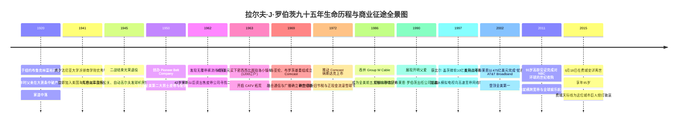
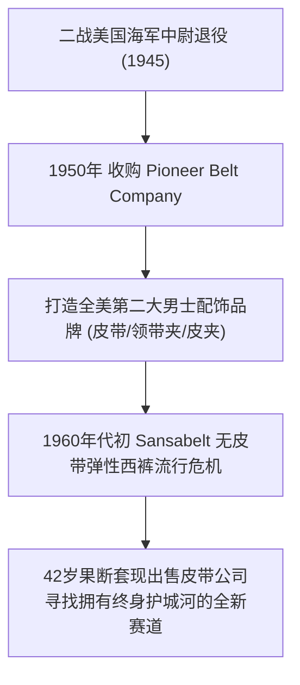
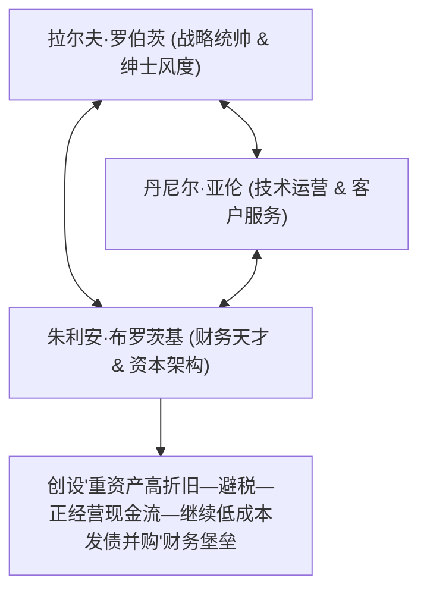

# 拉尔夫·J·罗伯茨 (Ralph J. Roberts)：男士皮带商、密西西比天线拓荒者与康卡斯特传媒帝国奠基人传记

> **“做生意就像一场终身马拉松。不要被眼前的喧嚣所迷惑，永远关注那些能产生源源不断现金流的基础资产。保持绅士的品格与诚实的账本，你就能在每一次行业危机中买下未来。”**  
> —— 拉尔夫·J·罗伯茨 (Ralph J. Roberts)

---

```text
==================================================================================================
【传主档案速览】
• 全名：拉尔夫·乔尔·罗伯茨 (Ralph Joel Roberts)
• 生卒年份：1920 年 3 月 13 日 — 2015 年 6 月 18 日 (享年 95 岁)
• 出生地：美国纽约市布鲁克林区 (Brooklyn, NY) | 逝世地：宾夕法尼亚州费城
• 身份：康卡斯特公司 (Comcast Corporation) 创始人、长期首席执行官与董事会主席
• 学历：宾夕法尼亚大学沃顿商学院经济学学士 (Wharton School, Class of 1941)
• 核心创业成就：从密西西比小镇1200户小有线网起步，缔造全美最大宽带与NBC环球娱乐帝国
• 核心合伙铁三角：拉尔夫·罗伯茨 (战略统帅)、丹尼尔·亚伦 (运营专家)、朱利安·布罗茨基 (财务天才)
• 核心精神图腾：绅士风度、极度保守的财务纪律、长期家族信托、尊重伙伴、专注现金流
==================================================================================================
```

---

## 🧭 全景生命历程与重大历史决断编年轴 (Chronological Epic)



---

## 🎩 第一章：大萧条冲击、沃顿商学院求学与二战海军军官 (1920 — 1945)

### 1. 布鲁克林的富足童年与大萧条厄运
1920年3月13日，拉尔夫·J·罗伯茨出生于纽约市布鲁克林区一个富裕的犹太家庭。
- 父亲罗伯特·罗伯茨是一名成功的药品分销商和投资者，母亲萨拉操持家务。在童年早期，拉尔夫过着优渥的生活，就读于私立学校。
- 然而，1929年华尔街股灾引发大萧条，父亲的商业帝国瞬间崩塌，巨额债务接踵而至。1933年，在拉尔夫仅 13 岁时，心力交瘁的父亲突发心脏病猝然离世。
- 面对家道中落，拉尔夫从小便学会了做各种零工分担家计，在母亲坚强品格的熏陶下，养成了极度坚韧、温文尔雅且对财务风险保持高度警惕的性格底色。

### 2. 沃顿商学院的洗礼与二战太平洋军功
- 凭借优异的成绩和自筹资金，拉尔夫考入常春藤名校**宾夕法尼亚大学沃顿商学院 (Wharton School)**，主修经济学与商业分析。
- 在沃顿期间，他展现出卓越的沟通天赋与财务分析能力，于 1941 年顺利毕业。
- 毕业不久，日本偷袭珍珠港，美国全面卷入第二次世界大战。拉尔夫应征入伍加入美国海军，官拜海军中尉，在大西洋与太平洋战区负责海军后勤与装备管理，严格的军队组织纪律进一步淬炼了他的领导魄力。

---

## 👔 第二章：男士皮带大王：先锋皮带公司的辉煌与中年突围 (1946 — 1962)



### 1. 打造全美第二大男士配饰帝国
二战退役后，拉尔夫在费城做过交响乐公关，推销过自动高尔夫球发球机。
- 1950年，拉尔夫凑齐资金收购了费城一家濒临破产的百年老牌皮带作坊——**先锋皮带公司 (Pioneer Belt Company)**。
- 他重新设计了充满现代质感的男士皮带扣、领带夹和皮夹，请来好莱坞明星代言，将皮带从单纯的功能性裤带打造成男士时尚生活方式标志。
- 短短十年间，先锋皮带公司一跃成为全美仅次于 Hickok 的第二大男士配饰品牌，拉尔夫在 30 多岁便成为了费城商界著名的青年才俊。

### 2. “无皮带西裤”带来的中年危机与断臂套现
- 1960年代初，全美服装界突然掀起了一股流行狂潮：著名服装品牌推出了带有隐形弹性腰带的“Sansabelt 西裤”，男士穿西裤无需再系皮带。
- 敏锐的拉尔夫预感到了传统时尚消费品极易受到流行风向颠覆的致命弱点：**“不管你的皮带做得多好，只要明年设计师决定不系皮带，你的整个公司就会在一年内破产！”**
- 1962年，42岁的拉尔夫在先锋皮带利润最高的时刻，以极高的溢价将公司彻底出售套现，开始寻找一种**“无论外界风云如何变幻，消费者每个月都必须主动向你付钱”**的刚需重资产垄断行业。

---

## 📡 第三章：密西西比图珀洛的电波：买下 5 频道有线电视 (1963 — 1969)

### 1. 偶然的密西西比小镇考察 (1963)
1963年春天，一位经纪人向拉尔夫推荐了一个位于密西西比州东北部偏远小镇**图珀洛 (Tupelo)** 的小项目。
- 当时的全美三大广播电视网（CBS、NBC、ABC）信号受限于地形，根本无法覆盖深山和偏远乡村。
- 图珀洛当地一位工程师在一座高山顶上架设了一根巨大的公用接收天线，用同轴电缆将清晰的电视信号拉到小镇居民家里，每个月向每户收取 **5 美元** 的维护费。
- 这座小系统当时只有 **1,200 个订户、5 个电视频道**。

### 2. 看到商业终极真理的顿悟时刻
拉尔夫亲自乘飞机前往图珀洛小镇。当他站在山顶看着那根高耸的天线，走进小镇居民客厅看到一家老小围着清晰的电视屏幕发出欢声笑语时，拉尔夫的心脏狂跳不止：
- **“天哪！这就是我梦寐以求的完美生意！”**
  - **垄断性**：小镇不需要第二根天线，一旦电缆拉进客厅，没有人会轻易拔掉；
  - **现金流**：用户每个月像交水费电费一样按时交月租费；
  - **抗周期**：无论经济萧条还是繁荣，人们都离不开家庭娱乐。
- **1963年6月**，拉尔夫以 50 万美元全资买下了图珀洛有线电视系统，正式开启了康卡斯特长达六十年的征途！

---

## 🛡️ 第四章：铁三角与财务堡垒：朱利安·布罗茨基的折旧飞轮 (1970s — 1980s)



### 1. 传奇“铁三角”合伙模式
拉尔夫在创业初期组建了被全美商学院传颂的“康卡斯特三驾马车”：
- **拉尔夫·罗伯茨**：最高战略决断者，以无可挑剔的绅士品格赢得政界与银行界的无限信任；
- **丹尼尔·亚伦 (Daniel Aaron)**：二战难民出身的技术运营大师，负责全美网络施工与服务质量；
- **朱利安·布罗茨基 (Julian A. Brodsky)**：天才特许公认会计师（CPA），担任首席财务官。

### 2. 颠覆华尔街会计学的“现金流飞轮”
在1970年代，华尔街传统分析师只看净利润（Net Income），认为有线电视铺设电缆前期亏损巨大，是垃圾资产。
- 朱利安·布罗茨基与拉尔夫开创了一套全新的估值体系：**EBITDA（税息折旧及摊销前利润）与自由现金流**。
- 有线电视初期巨大的电缆铺设成本可以通过极高年限的折旧彻底抵消应纳税所得额（实现合法零交税），而账面上产生出源源不断的巨额真实正现金流！
- 康卡斯特利用这一财务引擎，以极低的杠杆和极强的财务纪律，在全美数十个州掀起了扫荡式的有线网络并购狂潮。

---

## 👑 第五章：代际交棒与两次“蛇吞象”：AT&T 宽带与 NBC 环球 (1990 — 2015)

### 1. 提拔31岁少帅：布莱恩·罗伯茨接棒
拉尔夫展现了极其罕见的现代家族企业开明传承：
- 他的次子**布莱恩·罗伯茨 (Brian L. Roberts)** 从小在公司基层爬电线杆、修电缆、做电话推销员。沃顿商学院毕业后，布莱恩展现出了超越其父的宏大商业格局。
- **1990年**，70岁的拉尔夫力排众议，任命年仅 31 岁的布莱恩出任康卡斯特总裁，自己退居幕后担任董事会主席和精神导师。

### 2. 1997年比尔·盖茨十亿美元注资与宽带革命
- 1997年，布莱恩和拉尔夫在西雅图与微软创始人比尔·盖茨共进晚餐。
- 盖茨敏锐地意识到：未来的互联网必须通过高速有线宽带（Cable Modem）而不是慢如蜗牛的电话拨号线连接。
- 微软当场宣布向康卡斯特战略注资 **10 亿美元**，这笔背书彻底引爆了全美宽带大提速的黄金时代！

### 3. 两次震动全球的“蛇吞象”世纪并购
- **2002年并购 AT&T Broadband（475亿美元）**：
  - 康卡斯特以小博大，击败美国在线时代华纳等巨头，将全美第一大电信巨头旗下的宽带资产收入囊中，订户猛增至 2,100 万，一举成为全美第一大有线宽带霸主！
- **2011-2013年并购 NBCUniversal（近300亿美元）**：
  - 在拉尔夫 90 岁高龄的注视下，康卡斯特完成了对百年好莱坞巨头 NBC 环球的全资收购，将《小黄人》《侏罗纪公园》、NBC 电视网以及全球环球影城全产业链彻底纳为一体！

---

## 🧠 第六章：拉尔夫·J·罗伯茨的底层认知工具箱

### 1. 绅士经商哲学 (Gentlemanly Capitalism)
- 在充斥着恶意收购和野蛮人的华尔街，拉尔夫终生坚持“不做恶意收购、不背弃承诺、不公开羞辱对手”。他的温和、正直和守信，使康卡斯特在半个世纪里成为了全美各大家族有线网在出售时的“最受信赖托付者”。

### 2. 极度保守的流动性安全边际 (Financial Fortress)
- 拉尔夫给公司立下铁律：**无论并购规模多大，账面必须时刻保留足够的现金储备以应对连续三年的极端萧条**。在2000年互联网泡沫破裂和2008年次贷危机中，当竞争对手纷纷破产重组时，康卡斯特始终屹立不倒。

---

## 💬 第七章：经典名言金句与传奇轶事

1. **拉尔夫关于代际传承的智慧**：
   > “做父母最伟大的成就，不是让孩子生活在你的阴影下，而是搭建一座足够宽阔的舞台，然后退到幕后，为他们的每一次精彩起跳由衷鼓掌。”

2. **名震费城的“领带故事”**：
   - 拉尔夫一生对领带情有独钟。即使到了90岁高龄，他每天出现在费城康卡斯特中心大堂时，依然身着剪裁完美的三件套西装，系着一条精心挑选的丝绸领带。每当遇到新入职的年轻工程师，他都会微笑着停下脚步帮对方整理领口，成为康卡斯特最具温情的人文图腾。

3. **2015年费城天际线的敬礼**：
   - 2015年6月18日，拉尔夫在费城安详离世，享年95岁。
   - 当晚，高达 297 米的费城地标建筑——康卡斯特中心大厦顶层的灯光全部熄灭，向这位改变了全美信息与娱乐传播版图的商业绅士致以崇高的敬意。
