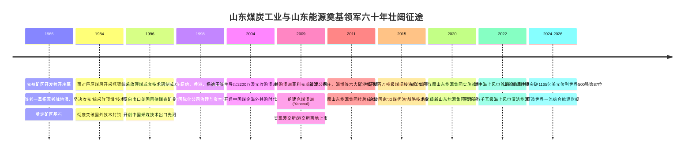
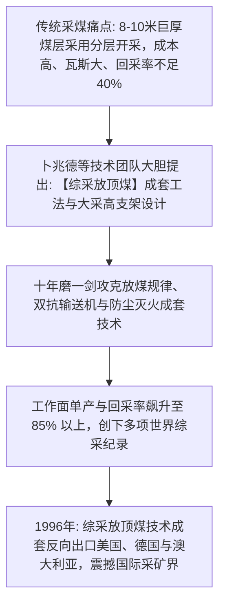
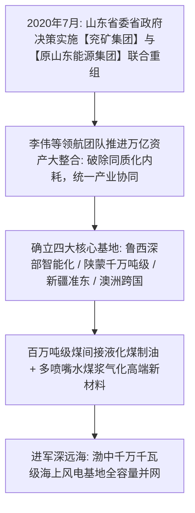

# 卜兆德、杨德玉与山东能源奠基开拓者：乌金铸魂、综采突破与跨国出海的工业壮歌

> **“煤炭是工业的粮食。千米地底深处的每一块乌金，都凝结着无数矿工的汗水与智慧。我们不仅要敢向地心要光明，更要靠自主技术让中国煤炭工业昂首挺胸走向世界！”**  
> —— 卜兆德 (原兖矿集团主要奠基人、老矿长)

---

```text
==================================================================================================
【奠基主线与领航档案速览】
• 奠基领军者一：卜兆德 (Bu Zhaode) —— 兖矿主要奠基人、老领导，带领矿山攻克综采放顶煤
• 奠基领军者二：杨德玉 (Yang Deyu) —— 跨国出海破冰者，主导 2004 年跨国并购澳大利亚南田煤矿
• 重组领航团队：李伟等新一代领军者 —— 主导兖矿与山能两万亿资产世纪重组与绿色低碳跃迁
• 历史大背景：从新中国华东重工业能源大保供，到深井综采技术突破，再到全球化跨国并购与超级重组
• 核心技术丰碑：综采放顶煤成套技术全球反向输出、全球首套百万吨煤间接液化、水煤浆多喷嘴气化
• 核心精神图腾：乌金报国、坚韧拓荒、深井安全零容忍、跨国资本运作、绿色多能转型
==================================================================================================
```

---

## 🧭 全景奠基历程与重大历史决断编年轴 (Chronological Epic)



---

## 🎬 第一章：荒原拔地起矿城：兖州矿区会战与深部地质攻坚 (1966 — 1984)

### 1. 华东“煤荒”困局与兖州会战号角
- 1960 年代，中国华东沿海地区工业蓬勃发展，但能源供应极度紧缺，煤炭调运经常面临“无米下锅”的严峻局面。
- 1966 年起，国家决定集中力量开发地处鲁西南的**兖州煤田**（赋存丰富的特低灰、特低硫、高发热量优质动力煤与炼焦煤）。
- 卜兆德等老一辈矿山创业者带领数万名建设大军奔赴这片荒滩农田，搭起简易芦苇工棚，拉开了波澜壮阔的矿区建设大序幕。

### 2. 克服“高地温、大涌水、厚冲积层”三大天险
- 兖州煤田地质条件极其复杂：
  1. 表层覆盖着上百米厚含水流砂层，开凿立井极易发生井壁溃砂塌方；
  2. 深部千米地层地压极大，顶板极易大面积冒顶垮塌；
  3. 井下地温高达近 40 摄氏度，湿度超过 90%，犹如蒸笼。
- 卜兆德带领工程技术人员和矿工夜以继日奋战，推行“冻结法凿井”与锚喷支护技术，克服了常人难以想象的恶劣环境，先后建成了鲍店、东滩、兴隆庄等一批当时国内最高水平的现代化特大型矿井。

---

## 🌪️ 第二章：技术封神：“综采放顶煤”技术突破与反向出口西方 (1984 — 1998)



### 1. 破解巨厚煤层开采的世界级死局
- 面对 8 至 10 米厚的特厚煤层，传统开采方法是“分层开采”——一层一层向下割煤。不仅巷道掘进量巨大、生产成本高昂，而且采空区极易发生遗煤自燃和瓦斯爆炸事故，资源回采率不足 40%。
- 卜兆德与总工程师团队大胆提出：**能不能在煤层底部割一刀，利用地层自重压力让上部的顶煤自动垮落破碎，再通过支架后方的放煤口运出来（综采放顶煤）？**

### 2. 反向输出西方：中国采矿技术的国际荣光
- 历经十余年数千次试验攻关，团队彻底攻克了厚煤层放顶煤运移规律、大工作阻力低位放顶煤液压支架、高压喷雾灭尘等全套工艺。
- 这一技术使煤矿综采工作面年产量从几十万吨直接跃升至数百万吨乃至上千万吨，资源回收率超过 85%，荣获国家科技进步一等奖。
- **1996 年**，兖矿的综采放顶煤技术被美国固德瑞奇矿业公司（Goodrich）以专利许可形式成套引进；随后又成功出口至德国、澳大利亚等传统采矿强国，开创了**新中国采煤工艺技术向西方发达国家反向出口的历史先河**！

---

## 🛡️ 第三章：跨国出海破冰：杨德玉主导并购澳洲南田煤矿 (2004 — 2011)

### 1. 2004年：3200万澳元首开中国煤企海外并购先例
- 2000 年代初，中国加入 WTO 后对优质能源需求激增。杨德玉等领导班子敏锐预判：单纯依靠国内资源难以为继，必须在全球范围内配置战略资产！
- 2004 年，兖矿以 **3200 万澳元** 成功竞购澳大利亚破产的南田煤矿（Southland Colliery）。
- 当时国内外舆论一片质疑，认为中国企业缺乏跨国管理经验，根本无法应对澳大利亚严苛的法律、环保与工会要求。

### 2. 奇迹扭亏与组建“兖煤澳洲 (Yancoal)”
- 团队进驻后，引入中国先进的综采放顶煤技术和高效精益管理，仅用一年时间便将这座被外国矿业公司判定“无法开采”的废矿重新盘活扭亏为盈。
- 随后，兖矿在澳洲接连主导并购菲利克斯资源公司（Felix Resources）与力拓旗下联合煤炭公司（Coal & Allied），组建了**兖煤澳洲 (Yancoal Australia)**。
- 兖煤澳洲成为澳大利亚第一大独立煤炭生产商，在澳交所与港交所两地成功上市，创造了中国企业跨国出海“买得起、管得好、能共赢”的国际教科书案例。

---

## 👑 第四章：两强世纪重组与万亿综合能源旗舰腾飞 (2020 — 至今)



### 1. 2020年：兖矿与山能万亿级强强联合
- 2020 年 7 月，为打造具有全球竞争力的世界一流能源企业，山东省委省政府决定将兖矿集团与原山东能源集团实施战略重组。
- 在李伟等新一代领军团队带领下，重组团队在短短数月内完成了涉及 20 余万员工、两万亿资产的庞大机构重塑与业务整合，彻底消除了省内两家煤企原有的同质化恶性竞争与重叠投资。

### 2. 煤制油自主突围与海上风电新能源
- 集团自主研发的全球首套百万吨级煤间接液化（煤制油）装置高效稳定运行，构建起国家“以煤代油”战略技术长城；
- 大力布局海上风电与新型储能，在渤海中部建成了千万千瓦级海上风电大基地，实现从传统“黑色煤炭开采”向“风光火储氢一体化绿色能源”的世纪跨越。

---

## 🧠 第五章：山东能源奠基先驱底层认知工具箱 (Mental Model Toolkit)

```text
==================================================================================================
【山东能源奠基开拓者六大核心认知工具箱】

1. 乌金报国与矿山坚韧拓荒精神 (Frontier Mining Resilience)
   • 核心心法：在千米地底深处的极端恶劣环境中，唯有钢铁般的纪律、求真务实的作风
               与艰苦奋斗的奉献精神，才能战胜地质天险，保障国家能源命脉。

2. 极端工况技术创新第一性原理 (Breakthrough Mining Engineering)
   • 核心心法：不迷信国外现成工艺，从地层物理应力与煤岩结构本质出发，
               自主发明“综采放顶煤”工法，把理论设想转化为可大规模复制的工业生产力。

3. 跨国资源并购与本土化协同闭环 (Global Resource M&A & Localization)
   • 核心心法：海外并购成功的关键不在于资金规模，而在于技术输出能力、合规文化尊重
               与本土化团队激励。用中国先进采矿技术赋能海外资产，实现利益共享。

4. 现代企业治理与资本市场多地联动 (Multi-Market Capital Structure)
   • 核心心法：善于利用资本市场杠杆，境内外多地挂牌上市（A+H+澳股），
               引入国际机构投资者，用透明严谨的现代公司治理抵御大宗商品周期波动。

5. 传统化石能源低碳转型 S 曲线 (Energy Transition S-Curve)
   • 核心心法：在第一曲线（煤炭采选）产生充沛现金流时，提前数年重金布局第二曲线
               （高端煤制油气化工）与第三曲线（海上风电与绿氢储能），实现平稳穿越周期。

6. 超大型国企战略重组协同效应挖掘 (Mega-Merger Synergy Maximization)
   • 核心心法：大重组不仅是物理层面的资产合并，更是组织文化、供应链与产业布局的化学融合，
               通过去重增效与集中采购，释放万亿级规模经济效应。
==================================================================================================
```

---

## 💬 第六章：奠基先驱传世经典名言金句 (Iconic Quotes)

1. **卜兆德论矿山精神**  
   > *“煤炭是工业的粮食。千米地底深处的每一块乌金，都凝结着无数矿工的汗水与智慧。我们不仅要敢向地心要光明，更要靠自主技术让中国煤炭工业昂首挺胸走向世界！”*

2. **杨德玉论跨国出海**  
   > *“走出国门搞并购，不能盲目蛮干。我们手里有世界上最好的采煤工法，我们带着诚意和专业去合作，就能在异国他乡扎下根来、开花结果！”*

3. **山东能源精神誓言**  
   > *“厚德至善，乌金铸魂！我们将以坚如磐石的担当，把大国能源饭碗牢牢端在自己手里，点亮神州大地的璀璨繁华！”*
