# 瓦莱罗能源公司 (Valero Energy Corporation) —— 全球最大独立原油精炼商与可再生燃料巨擎全景介绍

> **《财富》世界500强排名：第 88 位**  
> **年度营业收入：$115,939 百万美元（约 1159.4 亿美元）**  
> **官方网站：[www.valero.com](https://www.valero.com)**

---

## 🏢 企业基本信息 (Corporate Snapshot)

| 维度 | 详细信息 |
| :--- | :--- |
| **公司全称** | 瓦莱罗能源公司 (Valero Energy Corporation) |
| **成立时间** | 1980 年 1 月 1 日 (由 Coastal States Gas 陷入危机的天然气资产重组分拆设立) |
| **全球总部** | 🇺🇸 美国 德克萨斯州 圣安东尼奥 (One Valero Way, San Antonio, TX) |
| **创始人 / 功勋领袖** | 威廉·E·“比尔”·格里希 (William E. "Bill" Greehey) |
| **现任 CEO** | 莱恩·里格斯 (Lane Riggs, 首席执行官兼总裁) |
| **股票代码** | NYSE: `VLO` (标普500指数核心成分股) |
| **全球员工总数** | 约 **1.0+ 万人**（人均创收超千万美元，全球运营效率最高的能源巨头之一） |
| **原油日精炼产能** | 超 **320 万桶/天** (运营 15 座位于美国墨西哥湾沿岸、中大陆、西海岸及英国、加拿大的巨型炼油厂) |
| **核心业务赛道** | 独立原油精炼与成品油销售 (Refining)、低碳可再生柴油 (Diamond Green Diesel - DGD)、乙醇生物燃料 (Ethanol) |

---

## 🌐 核心业务矩阵与全球精炼版图 (Business Architecture)

```mermaid
graph TD
    VALERO["瓦莱罗能源帝国 (Valero Energy Corporation)"]
    
    VALERO --> REF["1. 独立原油精炼业务 (Petroleum Refining)"]
    REF --> REF1["墨西哥湾沿岸超级炼油厂集群 (Corpus Christi / Port Arthur / Texas City / St. Charles 等)"]
    REF --> REF2["美国中大陆与加州精炼厂 (McKee / Ardmore / Benicia)"]
    REF --> REF3["海外精炼资产 (英国 Pembroke / 加拿大 Jean Gaulin 炼油厂)"]
    REF --> REF4["超低硫汽油、航空煤油、超低硫柴油与沥青"]
    
    VALERO --> RENEW["2. 可再生柴油 (Diamond Green Diesel - DGD)"]
    RENEW --> RENEW1["与 Darling Ingredients 联合合资平台 (DGD)"]
    RENEW --> RENEW2["利用废弃动植物油脂/地沟油生产高品质低碳可再生柴油"]
    RENEW --> RENEW3["可持续航空燃料 (Sustainable Aviation Fuel - SAF)"]
    
    VALERO --> ETH["3. 乙醇生物燃料 (Ethanol Segment)"]
    ETH --> ETH1["美国中西部 12 座大型玉米乙醇加工厂"]
    ETH --> ETH2["年产超 16 亿加仑变性燃料乙醇"]
    ETH --> ETH3["副产品高蛋白动物饲料 (DDGS) 与生物碳捕集"]
    
    VALERO --> LOG["4. 物流管道与全球海运网络 (Logistics & Export)"]
    LOG --> LOG1["墨西哥湾沿岸深水原油与成品油装卸码头"]
    LOG --> LOG2["数千英里跨州成品油输送管道与调运油库"]
    LOG --> LOG3["辐射拉美（墨西哥/秘鲁）、欧洲与亚洲的成品油出口分销"]

    classDef main fill:#004879,stroke:#e31b23,stroke-width:2px,color:#fff;
    classDef branch fill:#222,stroke:#004879,stroke-width:1px,color:#fff;
    classDef sub fill:#f4f7f9,stroke:#004879,stroke-width:1px,color:#000;
    class VALERO main;
    class REF,RENEW,ETH,LOG branch;
    class REF1,REF2,REF3,REF4,RENEW1,RENEW2,RENEW3,ETH1,ETH2,ETH3,LOG1,LOG2,LOG3 sub;
```

---

## ⚡ 核心竞争壁垒与精炼护城河 (Competitive Advantages)

### 1. 极度领先的高尼尔森复杂性指数 (Nelson Complexity Index)
- 瓦莱罗旗下的炼油厂平均复杂性指数在全美同业中名列前茅。
- 其装置配备了极高密度的重油加氢裂化、焦化与催化裂化装置，能够以极大幅度（每桶贴水数美元至十余美元）采购全球最难提炼的高硫重质原油（如加拿大油砂重油、墨西哥玛雅重油、哥伦比亚重油），并以高达 90% 以上的收率转化为高价值的超低硫汽油与航空煤油，获取远超普通炼油厂的裂解价差（Crack Spread）。

### 2. 纯独立精炼商模式的灵活资本配置
- 不同于埃克森美孚、雪佛龙等垂直整合石油巨头（需承担每年数百亿美元高风险的上游油田勘探与钻井巨额 Capex），瓦莱罗是纯粹的下游独立炼油商。
- 瓦莱罗将全部资本聚焦于精炼装置能效提升、检修维护与低碳可再生燃料，并通过丰厚的股票回购和股息分红持续回馈股东。

### 3. 全球最大低碳可再生柴油 (DGD) 霸主地位
- 瓦莱罗与全球最大废弃油脂回收巨头 Darling Ingredients 设立的合资企业 **Diamond Green Diesel (DGD)**，年产能超 12 亿加仑，是全球规模最大、成本最低的可再生柴油和可持续航空燃料 (SAF) 生产商，在欧美低碳燃料法规（LCFS）下享有高额碳补贴与极高溢价。

### 4. 墨西哥湾黄金物流水道与全球出口网络
- 绝大部分主力炼厂位于墨西哥湾沿岸，坐拥深水泊位与直通全美的输油管网，能够以极低海运费将成品油源源不断出口至墨西哥、南美洲与欧洲，成为西半球能源贸易的超级枢纽。

---

## 📈 历史里程碑年表 (Historical Milestones)

- **1980年1月**：比尔·格里希受命将陷入破产边缘的 LoVaca 天然气管网从 Coastal 公司剥离，正式成立瓦莱罗能源公司（以圣安东尼奥历史传教所原名 San Antonio de Valero 命名）。
- **1984年**：在科珀斯克里斯蒂（Corpus Christi）斥资 10 亿美元建成世界上最先进的重油加氢裂化装置（SABAR），奠定复杂炼油技术底座。
- **1997年**：格里希做出惊人战略决断：将传统天然气管网业务以 15 亿美元出售给 PG&E，收购 Basis Petroleum 炼油厂，全面转型为纯下游独立原油精炼巨头。
- **2000年**：以 6 亿美元收购埃克森美孚位于加州贝尼西亚（Benicia）的炼油厂及零售网络。
- **2001年**：以 60 亿美元巨资合并收购 **Ultramar Diamond Shamrock (UDS)**，一跃成为全美第二大独立炼油商。
- **2005年**：以 **80 亿美元** 成功收购 **Premcor Inc.**，原油加工能力突破 300 万桶/天，正式登顶全美及全球第一大独立原油精炼商王座。
- **2006年**：功勋创始人比尔·格里希卸任 CEO，交棒给比尔·克莱斯（Bill Klesse）。
- **2009-2010年**：逆势以极低折扣收购破产的 VeraSun 旗下多座乙醇工厂，大举进军生物乙醇能源产业。
- **2013年**：与 Darling Ingredients 合资的 Diamond Green Diesel (DGD) 第一期可再生柴油项目投产。
- **2024-2026年**：DGD 可持续航空燃料 (SAF) 项目全面达产，重劣原油炼化价差红利持续释放，年营业收入突破 1159 亿美元，稳居《财富》世界500强第 88 位。

---

## 🎯 企业文化与价值观 (Valero Culture)

1. **安全与环保第一 (Safety & Environmental Excellence)**：将生产安全视作一切经营的前提，拥有全美能源业最低的事故工伤率。
2. **员工优先与家庭文化 (Caring for Employees)**：创始人比尔·格里希奠定的传奇文化——提供业内最丰厚的福利保障与职业尊重，“把员工当成家人一样对待”。
3. **卓越运营与成本领先 (Operational Excellence)**：以严苛的装置可靠性与能效管理实现全球最低的桶油加工成本。
4. **社区回馈与慈善向善 (Community Stewardship)**：每年通过联合之路 (United Way) 等向炼厂所在社区捐赠数千万美元，积极履行企业公民责任。
