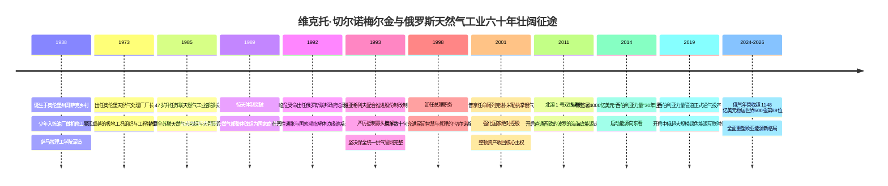
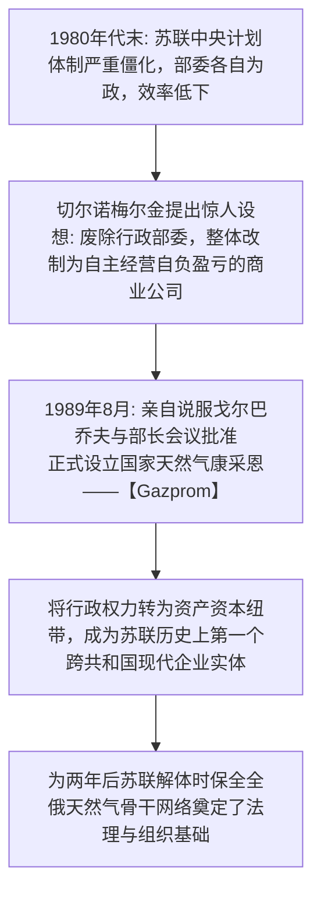
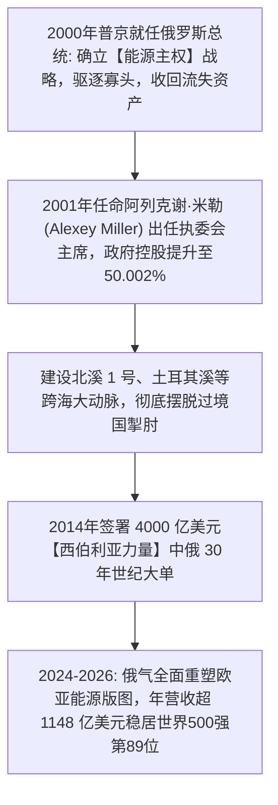

# 维克托·切尔诺梅尔金与俄气奠基先锋：部委转轨、保全管网与能源地缘博弈的史诗全景

> **“我们想把事情做好，结果却跟平时一样 (We wanted the best, but it turned out like always) —— 但在天然气工业上，我们守住了国家最坚固的底牌！只要这口巨大的气井还在喷涌，俄罗斯就永远不会倒下！”**  
> —— 维克托·切尔诺梅尔金 (Viktor Chernomyrdin)

---

```text
==================================================================================================
【奠基主线与领袖档案速览】
• 奠基缔造者：维克托·斯捷潘诺维奇·切尔诺梅尔金 (Viktor Stepanovich Chernomyrdin, 1938 — 2010)
• 历史身份：苏联天然气工业部最后一任部长、Gazprom 缔造者兼首任董事长、俄罗斯联邦总理 (1992-1998)
• 核心历史功绩：
  1. 1989年推动苏联天然气工业部整体改组为国家商业康采恩 (Gazprom)，开创转轨经济体制先河；
  2. 在 1990 年代大动荡与私有化狂潮中，坚决捍卫“统一供气系统 (UGSS)”不可分割的红线；
  3. 保住了俄罗斯日后大国复兴与地缘博弈的最核心工业底牌。
• 传承掌舵：雷姆·维亚希列夫 (保全管网) → 阿列克谢·米勒 (国家控股、跨国大动脉与向东看)
• 核心精神图腾：战略基础设施不可分割性、转轨期制度套利、能源即地缘政治杠杆、照付不议长约契约
==================================================================================================
```

---

## 🧭 全景奠基历程与重大历史决断编年轴 (Chronological Epic)



---

## 🎬 第一章：哥萨克热血、炼油厂机修工与奥伦堡天然气崛起 (1938 — 1985)

### 1. 哥萨克乡村少年的工匠底色
1938 年 4 月 9 日，维克托·斯捷潘诺维奇·切尔诺梅尔金出生在奥伦堡州一个传统的哥萨克村庄。
- 父亲是一名普通的集体农庄拖拉机手与红军老兵。切尔诺梅尔金从小在伏尔加河与乌拉尔河畔长大，继承了哥萨克民族坚韧、幽默与敢作敢当的性格。
- 1957 年高中毕业后，他在奥伦堡炼油厂从最底层的机修工和压缩机操作员做起。
- 随后他服兵役三年，退伍后进入**古比雪夫（现萨马拉）理工学院**深造，获得机械工程师学位。

### 2. 奥伦堡天然气处理厂的钢铁厂长
- 1960 年代末，西西伯利亚与乌拉尔地区发现了储量惊人的超级气田。
- 1973 年，35 岁的切尔诺梅尔金被任命为全苏联最大的奥伦堡天然气处理厂厂长。
- 他在极度寒冷、高含硫剧毒气体的极端工况下，铁腕推行精细化管理与技术改造，将该厂打造成全苏联天然气深加工的示范样板。
- **1985 年**，凭借卓越的技术与管理实绩，年仅 47 岁的切尔诺梅尔金被苏共中央提拔为**苏联天然气工业部部长**，执掌全苏联庞大的油气命脉。

---

## 🌪️ 第二章：1989年世纪体制革命：部委变身商业巨无霸 (1985 — 1992)



### 1. 预见体制危机：把政府部委改组为企业
- 1980 年代末，戈尔巴乔夫推行“公开性与新思维”，苏联中央计划经济体制风雨飘摇，各加盟共和国各自为政。
- 切尔诺梅尔金敏锐地意识到：**如果继续保留政府部委的行政形态，一旦政治大厦崩塌，全苏联的天然气管网将被各地方势力切成碎片、彻底瘫痪！**
- 他做出了苏联历史上前所未有的惊天决断：**主动撤销苏联天然气工业部，将全部气田、管网、压气站和科研机构整体打包改组为一家自负盈亏、拥有完全独立法人资格的现代国家商业康采恩——Gazprom！**

### 2. 1989年8月：Gazprom 横空出世
- 1989 年 8 月，苏联部长会议正式通过决议，国家天然气康采恩 (Gazprom) 诞生，切尔诺梅尔金出任首任董事长。
- 这一改制将原先死板的行政命令彻底转变为基于合同与资本纽带的企业运转体系，使得天然气工业成为苏联解体前夕唯一能够保持正向现金流与高效运转的经济孤岛。

---

## 🛡️ 第三章：动荡年代的总理担当与保全“统一供气管网” (1992 — 2001)

### 1. 1992—1998：出任俄罗斯联邦总理
- 1991 年底苏联解体，新生的俄罗斯联邦陷入“休克疗法”带来的恶性通货膨胀、卢布贬值与国家濒临解体的深重灾难中。
- 1992 年 12 月，叶利钦总统任命务实稳健的切尔诺梅尔金出任俄罗斯联邦政府总理。
- 在长达六年的总理任期内，切尔诺梅尔金如同一位不知疲倦的消防队长，在扑灭恶性通胀、调解车臣危机、稳定国家预算等极其险恶的政治风浪中力挽狂澜。

### 2. 誓死捍卫“统一供气系统 (UGSS)”不可分割
- 1990 年代，以丘拜斯、盖达尔为代表的新自由主义经济学家与西方顾问极力主张将 Gazprom 彻底拆分成数十家互相竞争的独立小公司，并将其私有化出售给寡头和西方资本。
- 切尔诺梅尔金与其心腹接班人**雷姆·维亚希列夫 (Rem Vyakhirev)** 坚决抵制这一企图：
  - 切尔诺梅尔金拍着桌子怒吼：“你们把铁路拆成一段一段怎么通车？天然气管网是一个不可分割的物理有机体！谁要是敢肢解统一供气系统，谁就是俄罗斯的千古罪人！”
  - 维亚希列夫巧妙运用股份置换和内部交叉持股，将 Gazprom 牢牢维持为一个完整的大型整体，并保留了国家的核心控制权。
- 正是这一钢铁般的定力，使俄罗斯在 2000 年代普京总统上台后，拥有了迅速恢复国家元气、偿还外债并重返世界大国舞台的最坚固底牌！

---

## 👑 第四章：普京时代的国家控股与阿列克谢·米勒的战略东移 (2001 — 至今)



### 1. 2001年：阿列克谢·米勒接棒与国家控制权巩固
- 2001 年，普京总统任命年轻干练的**阿列克谢·米勒 (Alexey Miller)** 出任 Gazprom 执委会主席。
- 米勒发起雷霆行动，清理了流失在外的灰色资产，将俄罗斯联邦政府在俄气的直接与间接持股比例确立为绝对控股的 **50.002%**，确立了俄气作为“俄罗斯国家经济旗舰”的不可动摇地位。

### 2. 2014年：中俄 4000 亿美元世纪大单与西伯利亚力量
- 2014 年 5 月，在两国最高领导人共同见证下，中俄在上海签署了具有划时代历史意义的**《中俄东线天然气购销协议》**，总金额高达 **4000 亿美元**，供气期长达 30 年。
- 俄气投入数千亿卢布建设了长达数千公里的**“西伯利亚力量 (Power of Siberia)”**天然气管道，从极寒的恰扬达与科维克塔气田直通中俄边境黑河，于 2019 年 12 月正式开阀供气，开启了中俄能源战略协作的全新历史纪元。

---

## 🧠 第五章：切尔诺梅尔金底层认知工具箱与思维模型 (Mental Model Toolkit)

```text
==================================================================================================
【切尔诺梅尔金与俄气奠基领袖五大底层认知模型】

1. 战略基础设施不可分割性模型 (Indivisibility of Critical Infrastructure)
   • 核心心法：对于全国性管网、大电网等重资产网络型基础设施，统一规划与统一调度
               具有压倒性的系统效率与安全冗余。绝不能盲从教条主义拆分而自毁长城。

2. 转轨期制度套利与体制突围 (Institutional Arbitrage in Historical Transition)
   • 核心心法：在重大历史社会变革风暴来临前，敢于打破传统官僚部委框架，
               用现代公司制与资本契约保护核心生产力，把危机转化为制度创新的跳板。

3. 能源即国家地缘主权杠杆 (Energy as Geopolitical Sovereignty & Anchor)
   • 核心心法：大宗能源不仅是商品，更是维系大国地缘安全与外交博弈的核心筹码。
               掌控了不可替代的能源源头，就掌握了国际经贸规则与双边谈判的话语权。

4. 照付不议长周期跨国契约 (Take-or-Pay Long-Term Strategic Contracting)
   • 核心心法：面对数百亿美元的长周期重资产投资，必须通过 20-30 年期限的“照付不议”
               国家级合同锁定下游长期需求，消除大宗商品短期价格剧烈波动的投资风险。

5. 极度务实的危机治理与大局定力 (Pragmatic Survivalist Statecraft)
   • 核心心法：在面临内外交困的极端至暗时刻，不空谈高深理论，抓住最核心的经济发动机，
               用极度务实、甚至带有些许妥协的智慧维系系统运转，等待时代周期的转折。
==================================================================================================
```

---

## 💬 第六章：切尔诺梅尔金传世经典名言金句 (Iconic Quotes)

1. **论理想与现实（全俄传世名句）**  
   > *“我们想把事情做好，结果却跟平时一样 (We wanted the best, but it turned out like always)。”*  
   > _(«Хотели как лучше, а получилось как всегда»)_

2. **论国家能源命脉**  
   > *“俄罗斯幅员辽阔，但如果失去了统一的天然气动脉，我们的国家就会在冬天陷入冰封与瓦解。守护好这条管网，就是守护俄罗斯母亲的生命线！”*

3. **论务实行动与空谈**  
   > *“这里不是辩论俱乐部，这是需要真刀真枪干活的地方！不要给我们讲那些漂亮的大道理，先把眼前的机器修好、把天然气送进管道里去！”*
