# 戴尔科技公司 (Dell Technologies Inc.) —— 全球企业级IT基础设施与AI算力工厂巨擘全景介绍

> **《财富》世界500强排名：第 90 位**  
> **年度营业收入：$113,538 百万美元（约 1135.4 亿美元）**  
> **官方网站：[www.dell.com](https://www.dell.com)**

---

## 🏢 企业基本信息 (Corporate Snapshot)

| 维度 | 详细信息 |
| :--- | :--- |
| **公司全称** | 戴尔科技公司 (Dell Technologies Inc.，原 Dell Computer Corporation) |
| **成立时间** | 1984 年 5 月 3 日 (迈克尔·戴尔在德克萨斯大学奥斯汀分校宿舍创立 PC's Limited) |
| **全球总部** | 🇺🇸 美国 德克萨斯州 朗德罗克 (One Dell Way, Round Rock, TX) |
| **创始人 / CEO** | 迈克尔·戴尔 (Michael Dell, 董事长兼首席执行官) |
| **股票代码** | NYSE: `DELL` (标普500指数与标普100指数核心成分股) |
| **全球员工总数** | 约 **12.0+ 万人**（覆盖全球 180 多个国家的企业级销售与技术支持） |
| **核心业务赛道** | 基础设施解决方案集团 (ISG: AI 服务器/高密度企业存储/网络设备)、客户解决方案集团 (CSG: 商用PC/工作站/外星人电竞/消费笔记本)、戴尔 AI Factory (企业级生成式 AI 基础设施) |

---

## 🌐 核心业务矩阵与产品版图 (Business Architecture)

```mermaid
graph TD
    DELL["戴尔科技商业帝国 (Dell Technologies)"]
    
    DELL --> ISG["1. 基础设施解决方案集团 (ISG - Enterprise)"]
    ISG --> ISG1["PowerEdge 高性能与 AI 服务器集群 (XE9680 / 搭载英伟达 Blackwell)"]
    ISG --> ISG2["企业级存储系统 (PowerStore / PowerScale 全闪存阵列)"]
    ISG --> ISG3["数据保护与多云治理软件 (PowerProtect)"]
    ISG --> ISG4["开放网络交换机与超融合架构 (VxRail)"]
    
    DELL --> CSG["2. 客户解决方案集团 (CSG - Client Solutions)"]
    CSG --> CSG1["商用工作站与笔记本 (Latitude / Precision)"]
    CSG --> CSG2["高端消费与轻薄本 (XPS 系列)"]
    CSG --> CSG3["外星人电竞生态 (Alienware 高端游戏PC与外设)"]
    CSG --> CSG4["商用显示器与企业智慧办公配件"]
    
    DELL --> AI_FAC["3. 戴尔 AI 工厂 (Dell AI Factory with NVIDIA)"]
    AI_FAC --> AI1["全栈企业级生成式 AI 交钥匙工程 (On-Premises AI)"]
    AI_FAC --> AI2["高密度冷板直接液冷 (Direct Liquid Cooling - DLC)"]
    AI_FAC --> AI3["企业专有大模型微调与 RAG 检索增强架构"]
    
    DELL --> APEX["4. 订阅式多云服务 (Dell APEX As-a-Service)"]
    APEX --> APEX1["按需计费的弹性私有云与算力租赁 (IaaS)"]
    APEX --> APEX2["多云存储协同 (跨 AWS/Azure/Google Cloud 统一接入)"]

    classDef main fill:#007db8,stroke:#222,stroke-width:2px,color:#fff;
    classDef branch fill:#222,stroke:#007db8,stroke-width:1px,color:#fff;
    classDef sub fill:#f5f8fa,stroke:#007db8,stroke-width:1px,color:#000;
    class DELL main;
    class ISG,CSG,AI_FAC,APEX branch;
    class ISG1,ISG2,ISG3,ISG4,CSG1,CSG2,CSG3,CSG4,AI1,AI2,AI3,APEX1,APEX2 sub;
```

---

## ⚡ 核心竞争壁垒与飞轮护城河 (Competitive Advantages)

### 1. 全球领先的企业级生成式 AI 基础设施——Dell AI Factory
- 携手英伟达（NVIDIA）、AMD 等芯片巨头打造全球最完整的企业级 AI 算力方案。
- 旗舰 **PowerEdge XE9680** 8 卡 GPU AI 服务器与冷板液冷方案，已成为全球财富 500 强企业自建私有化大模型与算力集群的行业标杆，AI 算力服务器积压订单达数百亿美元。

### 2. 极致的精益供应链与直销客户亲密度
- 首创并延续至今的按单定制（Build-to-Order）精益制造与供应链体系，使得戴尔拥有全行业最短的库存周转天数与极高的营运资本效率；与全球万余家跨国企业、金融机构及政府机构建立了长达数十年的直销战略合作关系。

### 3. 全球顶尖的企业级存储与数据保护霸主地位
- 依托 2016 年并购 EMC 奠定的深厚技术底蕴，戴尔在外部企业存储系统（PowerStore、PowerScale、PowerMax）全球市场份额常年稳居第一，为全球企业核心资产提供高吞吐、零丢失的数据存储与容灾底座。

---

## 📈 历史里程碑年表 (Historical Milestones)

- **1984年5月**：19 岁的迈克尔·戴尔以 1000 美元在大学宿舍创立 PC's Limited，开创跳过中间商的 PC 直销革命。
- **1988年**：公司正式更名为戴尔电脑公司 (Dell Computer Corporation)，并在纳斯达克成功 IPO。
- **1992年**：迈克尔·戴尔以 27 岁之龄成为《财富》世界500强历史上最年轻的首席执行官。
- **1996年**：戴尔正式开通线上直销网站，成为全球最早利用互联网实现规模化电子商务的科技先锋。
- **2001年**：戴尔全球 PC 出货量超越康柏（Compaq），首次登顶**全球第一大个人电脑制造商**。
- **2013年**：面对 PC 行业滑坡与华尔街短期做空压力，迈克尔·戴尔联手银湖资本 (Silver Lake) 以 **249 亿美元** 完成科技史上最大规模私有化退市，摆脱短期季度财报束缚开启战略大转型。
- **2016年**：以 **670 亿美元** 天价成功收购全球数据存储与云虚拟化巨无霸 **EMC（含 VMware 控股权）**，完成全球科技史上最大宗并购，更名为“戴尔科技 (Dell Technologies)”。
- **2018年**：戴尔科技通过反向收购跟踪股票重返纽约证券交易所公开上市（NYSE: `DELL`）。
- **2021年**：完成对 VMware 的剥离交易，释放数百亿美元股东价值并大幅优化资产负债表。
- **2024-2026年**：携手英伟达推出“Dell AI Factory”，PowerEdge AI 服务器业务呈爆发式增长；年营业收入突破 1135 亿美元，稳居《财富》世界500强第 90 位。

---

## 🎯 企业文化与核心价值观 (The Dell Culture Code)

1. **诚信为本 (Integrity)**：在所有业务往来中坚守最高道德标准，视声誉为生命。
2. **客户至上 (Customer First)**：深入倾听客户真实痛点，以按需定制提供最契合的端到端方案。
3. **协作共赢 (Winning Together)**：倡导团队合力，激发全球十余万多元员工的创造力。
4. **崇尚行动与创新 (Innovation & Execution)**：敏捷决策，敢于承担经过精密测算的战略风险。
