# 比亚迪股份有限公司 (BYD Company Limited) —— 全球新能源汽车与绿色能源帝国全景介绍

> **《财富》世界500强排名：第 91 位**  
> **企业愿景：用技术创新满足人们对美好生活的向往 (Technology by Design)**  
> **官方网站：[www.bydglobal.com](https://www.bydglobal.com)**

---

## 🏢 企业基本信息 (Corporate Snapshot)

| 维度 | 详细信息 |
| :--- | :--- |
| **公司全称** | 比亚迪股份有限公司 (BYD Company Limited) |
| **成立时间** | 1995 年 2 月 10 日 (创立于中国广东省深圳市布吉) |
| **全球总部** | 🇨🇳 中国 广东省 深圳市 坪山区比亚迪路3001号六角大楼 |
| **创始人兼董事长** | 王传福 (Wang Chuanfu) |
| **股票代码** | HKEX: `01211` (H股) / SZSE: `002594` (A股) |
| **全球员工总数** | 约 70+ 万人（其中研发工程师超 10 万人，全球研发规模最大的车企之一） |
| **核心业务赛道** | 新能源乘用车与商用车、动力电池与储能系统、智能电子部件与EMS制造、轨道交通（云轨/云巴）、车规级半导体与芯片 |

---

## 🌐 核心业务矩阵与商业版图 (Business Ecosystem)

```mermaid
graph TD
    BYD["比亚迪商业帝国 (BYD Company Limited)"]
    
    BYD --> AUTO["1. 汽车与绿色出行 (Automotive & Mobility)"]
    AUTO --> AUTO1["大众主流矩阵: 王朝网 (汉/唐/宋/元/秦) & 海洋网 (海豹/海豚/海鸥/驱逐舰)"]
    AUTO --> AUTO2["豪华高端品牌: 腾势 (Denza D9/Z9GT)"]
    AUTO --> AUTO3["专业个性化品牌: 方程豹 (Leopard 5/8/3)"]
    AUTO --> AUTO4["百万级超豪华品牌: 仰望 (Yangwang U8/U9/U7)"]
    AUTO --> AUTO5["商用车与专用车: 纯电动大巴 (K系列)、纯电动卡车 (T系列)"]
    
    BYD --> BAT["2. 动力电池与储能 (FinDreams Battery / 弗迪电池)"]
    BAT --> BAT1["动力电池: 磷酸铁锂刀片电池 (Blade Battery) & CTB/CTC 电池车身一体化"]
    BAT --> BAT2["储能系统: 弗迪魔方电网级储能、工商业储能、家庭储能 (Energy Storage)"]
    
    BYD --> ELEC["3. 电子代工与消费精密制造 (BYD Electronics, 00285.HK)"]
    ELEC --> ELEC1["智能手机与平板代工 (苹果/华为/荣耀等核心结构件与整机组装)"]
    ELEC --> ELEC2["智能座舱硬件、智能家居、无人机与医疗器械精密部件"]
    
    BYD --> TECH["4. 核心零部件与半导体 (FinDreams Tech & Semiconductor)"]
    TECH --> TECH1["车规级 IGBT 芯片、SiC 碳化硅功率器件、MCU 微控制器"]
    TECH --> TECH2["动力总成: 骁云高效插混专用发动机、EHS 电混系统、八合一电动力总成"]
    TECH --> TECH3["底盘与智能控制: 易四方、云辇 (C/A/P/X)、天神之眼高阶智驾、璇玑整车智能化架构"]
    
    BYD --> RAIL["5. 绿色轨道交通 (Urban Rail Transit)"]
    RAIL --> RAIL1["跨座式单轨 (云轨 SkyRail)"]
    RAIL --> RAIL2["低运量胶轮有轨电车 (云巴 SkyShuttle)"]

    classDef main fill:#e60012,stroke:#000,stroke-width:2px,color:#fff;
    classDef branch fill:#1c1c1c,stroke:#e60012,stroke-width:1px,color:#fff;
    classDef sub fill:#f5f5f5,stroke:#333,stroke-width:1px,color:#000;
    class BYD main;
    class AUTO,BAT,ELEC,TECH,RAIL branch;
    class AUTO1,AUTO2,AUTO3,AUTO4,AUTO5,BAT1,BAT2,ELEC1,ELEC2,TECH1,TECH2,TECH3,RAIL1,RAIL2 sub;
```

---

## ⚡ 核心竞争壁垒与护城河 (Competitive Advantages)

### 1. 极致的产业链垂直整合能力 (Unrivaled Vertical Integration)
- **除轮胎与玻璃外全栈自研自造**：比亚迪打破了传统主机厂依赖博世（Bosch）、采埃孚（ZF）、大陆（Continental）等 Tier 1 供应商的传统模式。发动机、变速箱、电机、电控、IGBT/SiC 芯片、动力电池、车机中控乃至车门铰链和模具均由比亚迪下属事业部与“弗迪系”子公司独立研制。
- **抗供应链风险与极致成本穿透**：在缺芯、电池原材料剧烈波动等周期性危机中，比亚迪凭借内循环自供优势不仅保证了极高的交付时效，更通过庞大的规模效应将新能源整车成本控制做到了全球极致，具备了“电比油低”的行业定价主导权。

### 2. 颠覆性核心技术集群 (Breakthrough Technological Moats)
- **刀片电池 (Blade Battery)**：通过将磷酸铁锂电芯做成长条状并作为车身结构件（CTB/CTC），兼顾高体积能量密度与极致热安全性，成功通过电池行业最苛刻的“针刺穿刺实验”，彻底打破三元锂电池对中高端长续航的垄断。
- **第五代 DM 双模混动技术 (DM-i / DM-p)**：实现发动机热效率突破 46%，百公里综合油耗降至 2L 时代，综合续航里程突破 2000 公里，重塑全球混合动力汽车能耗标杆。
- **易四方 (e⁴) 与云辇 (DiSus) 智能车身控制系统**：四轮独立电机矢量控制技术，支持原地掉头、应急浮水、爆胎稳行；云辇系统覆盖阻尼、空气悬架到液压全主动控制，具备三轮行驶、原地起跳等极限底盘姿态控制能力。
- **璇玑架构 (Xuanji Architecture)**：实现整车智电融合，将整车智能与天神之眼高阶智驾、智能座舱深度打通。

### 3. 十万工程师军团与“技术鱼塘”战略 (R&D scale & Tech Fishpond)
- 比亚迪设立了中央研究院、汽车工程研究院、电力科学研究院等庞大研发中枢，研发人员突破 10 万人。
- **技术鱼塘哲学**：王传福强调，比亚迪在水塘里培育各种技术苗子，当市场需求爆发、时机成熟时，迅速捞起一条大鱼投入量产商业化，从而实现连续代际的技术领先。

---

## 📈 历史里程碑年表 (Historical Milestones)

- **1995年**：王传福在深圳龙岗布吉创立比亚迪实业，以 250 万元借款起步切入镍镉充电电池制造。
- **1997-2000年**：凭借“人+夹具”半自动化生产线击穿日系企业价格壁垒，进入摩托罗拉、诺基亚、爱立信供应链，成为全球最大手机电池供应商之一。
- **2002年**：在香港联交所主板挂牌上市（01211.HK），创下当年港股 IPO 认购神话。
- **2003年**：出资 2.69 亿元收购西安秦川汽车 77% 股权，正式跨界进军汽车产业，引发资本市场巨大争议与股价腰斩。
- **2005年**：首款自主研发轿车 **比亚迪 F3** 下线，凭借高性价比成为中国首款月销突破 3 万辆的国民神车。
- **2008年**：发布全球首款量产插电式混合动力轿车 **F3DM**；同年，沃伦·巴菲特（Warren Buffett）旗下的伯克希尔·哈撒韦以 2.3 亿美元认购比亚迪 10% 股份（由查理·芒格极力推荐）。
- **2010年**：提出“公交电动化”战略，纯电动大巴 K9 与纯电动出租车 e6 率先在深圳商用并走向欧洲、日本与美洲市场。
- **2020年**：重磅发布**刀片电池**并推出旗舰轿车**汉 (Han)**，单车均价突破 25 万元，开启品牌高端化跃升与销量爆发周期。
- **2021年**：发布 **DM-i 超级混动系统**，开启对传统燃油车市场的全面替代攻势。
- **2022年3月**：比亚迪宣布正式**停止燃油汽车整车生产**，成为全球首个停产纯燃油车的传统主机厂。
- **2023年**：发布百万级仰望品牌（U8/U9）与专业个性化方程豹品牌；全年新能源汽车销量突破 302 万辆，超越特斯拉登顶全球纯电动与新能源汽车销量榜首。
- **2024-2026年**：发布第五代 DM 技术与整车璇玑智能架构，年营收持续跃升并稳居《财富》世界500强前列，全面加速欧洲、南美、东南亚海外超级工厂布局。

---

## 🎯 企业文化与核心价值观 (Corporate Culture)

1. **技术为王，创新为本**：技术是比亚迪的立身之本，不盲目崇拜权威与外部封锁，坚信一切技术难题都可以通过中国工程师的刻苦攻关得以解决。
2. **造物先造人**：人才是企业最核心的资产。比亚迪从校园大量吸纳高校应届生，通过“明日之星”等体系化培训，给年轻人压担子、给舞台，培养了数十万懂产线、懂技术的本土工程专家。
3. **极度务实与工程师文化**：在比亚迪内部，崇尚深入产线、用数据和实验说话，破除等级森严的官僚作风。王传福常年身着工服穿梭于实验室和车间一线。
4. **敢为人先，战略定力**：在新能源汽车二十年的漫长寒冬中，比亚迪顶住亏损与外界质疑，坚持每年投入数百亿元用于电池与混动底座研发，展现了罕见的战略远见与耐性。
