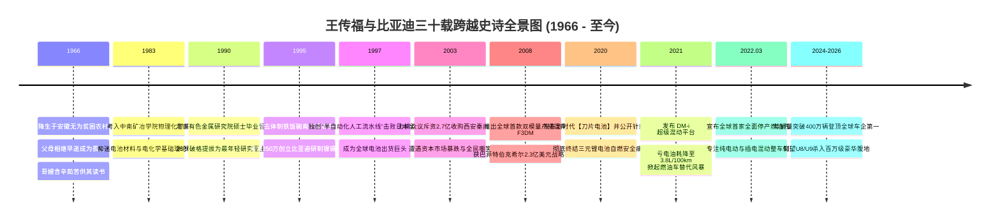
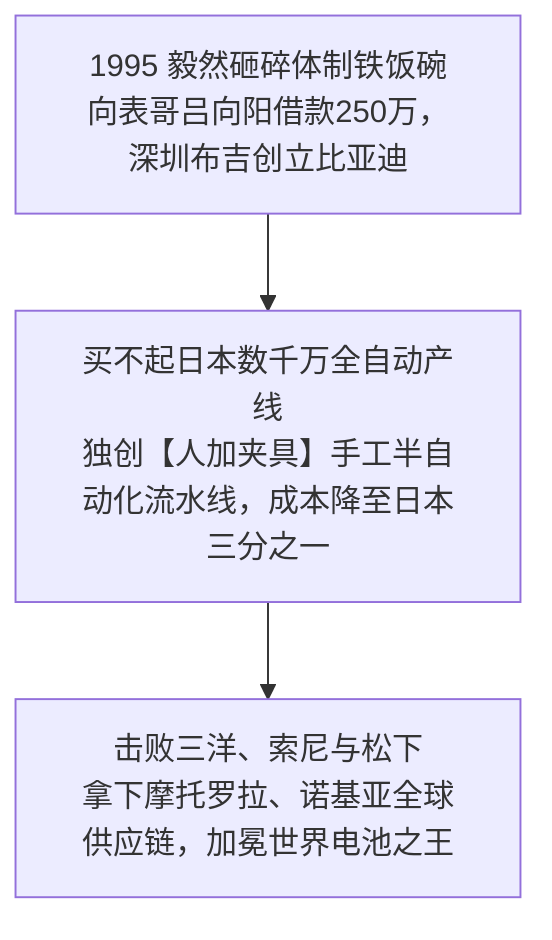
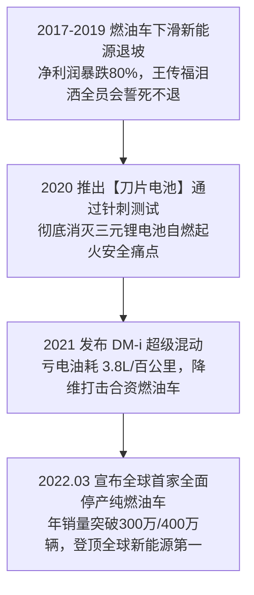

# 王传福 (Wang Chuanfu)：从安徽孤儿到全球新能源汽车王冠的工程师史诗传记

> **“很多人说我们是疯子，造电池的怎么可能造好汽车？我们就是要用中国工程师的智慧、中国制造业的极低成本与全产业链垂直整合，证明给全世界看：中国人不仅能造汽车，而且能在新能源这条全新赛道上彻底终结西方燃油车百年的神话！”**  
> —— 王传福（比亚迪股份有限公司董事长兼总裁）

---

```text
==================================================================================================
【传主档案速览】
• 全名：王传福 (Wang Chuanfu) | 1966.02.15 (水瓶座)
• 出生地：中国 安徽省 芜湖市 无为县
• 求学履历：中南工业大学 (现中南大学) 冶金物理化学学士 (1983–1987) -> 北京有色金属研究总院硕士 (1987–1990)
• 体制履历：26岁破格提拔为北京有色金属研究总院 301 节能材料室主任、深圳比格电池总经理
• 创办实体：比亚迪股份有限公司 (BYD Company Limited, 1995年创立)
• 颠覆领域：二次充电电池 (镍镉/锂电)、全产业链垂直整合新能源汽车、刀片电池 (Blade Battery)、DM-i超级混动、IGBT车规级芯片、仰望百万级豪华超跑
• 历史荣誉：巴菲特/芒格盛赞“爱迪生与韦尔奇的合体”、2025/2026年登顶全球新能源汽车销量冠军
• 核心精神图腾：技术为王、创新为本、工程师文化、极致垂直整合 (除了玻璃和轮胎全自研自造)
==================================================================================================
```

---

## 🧭 全景生命历程与比亚迪三十年征途编年轴 (Chronological Epic)



---

## 🌾 第一章：安徽无为孤儿、哥嫂恩重如山与电池硕士 (1966 — 1995)

### 1. 苦难童年与哥嫂卖嫁妆供读的恩情
- **1966 年 2 月 15 日**，王传福出生在安徽省芜湖市无为县一个极为贫寒的木匠家庭。
- **十三岁父母双亡的孤儿**：
  - 13 岁那年，父亲因肠癌不幸病逝；两年后母亲也因劳累过度撒手人寰。五个姐姐相继出嫁，妹妹被送人抚养，家中只剩下王传福与哥哥**王传方**相依为命。
- **哥嫂的崇高牺牲**：
  - 哥哥王传方毅然退学打工，承担起全家债务；大嫂张菊秀过门后，不仅没有嫌弃这个一贫如洗的家，反而卖掉了自己结婚时唯一的陪嫁金戒指，全力支持王传福读书。
  - 王传福在无为二中高中部拼命苦读，高考时以全县前列的优异成绩考入**中南矿冶学院（现中南大学）冶金物理化学专业**。

### 2. 中南大学与北京有色金属研究院的学术登顶 (1983–1990)
- 王传福在中南大学四年里，一头扎进了电化学储能材料的世界。
- **1987 年保送北京有色金属研究总院攻读硕士**：
  - 在北京期间，他师从中国著名电池专家，深入钻研碱性镍镉与镍氢二次充电电池的微观晶体结构。
- **26 岁的体制内最年轻主任 (1992)**：
  - 硕士毕业留院仅两年，26 岁的王传福因科研成果斐然，被破格提拔为有色金属研究院 301 节能材料研究室副主任（副处级待遇）。
  - 1993 年，研究院在深圳成立合资企业比格电池公司，王传福被派往深圳特区出任总经理。

---

## 🔋 第二章：布吉小作坊、手造流水线与打败日本巨头 (1995 — 2002)



### 1. 1995 年借款 250 万：布吉破旧厂房里的豪赌
- 1994 年底，王传福在行业报纸上捕捉到一条重要信息：日本因为环保法案即将全面淘汰传统的镍镉电池本土制造，而当时刚刚兴起的手提电话（大哥大）和寻呼机对可充电电池的需求正呈几何级数暴涨。
- **砸碎副处级铁饭碗**：
  - 王传福毅然向体制提交辞呈。他找到当时在广州从事房地产投资的表哥**吕向阳**，凭借对电池技术的透彻推演，说服吕向阳向其借资 **250 万元人民币**。
  - **1995 年 2 月**：在深圳市龙岗区布吉镇一个破旧的冶金大院里，**比亚迪实业 (BYD)** 正式挂牌成立，创业团队仅有二十余人。

### 2. 独创“人加夹具”流水线：中国制造的非对称降维打击
当时日本三洋、索尼等巨头采用一条全自动化电池生产线耗资高达数千万甚至上亿元人民币，刚刚创业的比亚迪根本买不起。
- **王传福的“反常识工程创新”**：
  - 王传福将整条高度复杂的电池生产工艺拆解为数十个简单的微步骤，自主设计低成本的木质与铁质简易夹具，**用中国吃苦耐劳的优质产业工人替代昂贵的机械手臂**。
  - 一条日本需要耗资 1 亿元的全自动产线，比亚迪用几百万元的国产夹具和数百名工人就完美实现，且成品良品率与日本设备毫无二致！
- **攻破摩托罗拉与诺基亚**：
  - 比亚迪电池的生产成本仅为日本巨头的 **1/3**。
  - 2000 年，王传福飞赴芝加哥摩托罗拉总部，凭借无懈可击的技术测试与不可思议的低价，一举拿下摩托罗拉手机锂电池核心供应商资质，随后攻克诺基亚、爱立信、西门子。
  - **2002 年 7 月**：比亚迪在香港联交所成功上市（01211.HK），创下当时港股最高超额认购纪录，王传福加冕全球“电池大王”。

---

## 🚗 第三章：2.7 亿买秦川汽车、全网嘲笑与垂直整合铁律 (2003 — 2019)

### 1. 2003 年收购秦川汽车：遭遇资本市场血洗的“造车疯子”
- 2003 年 1 月，王传福宣布了一项震惊资本市场的决定：**比亚迪斥资 2.7 亿元人民币，全资收购西安秦川汽车 77% 的股权，正式跨界进军汽车制造行业！**
- **投资人的狂怒与股价暴跌**：
  - 消息公布当天，港股投资人疯狂抛售比亚迪股票，两天内股价暴跌超过 **30%**，市值蒸发数十亿。基金经理在电话里愤怒地咆哮：“王传福你疯了吗？一个做手机电池的凭什么去碰最复杂的汽车工业？”
  - 王传福在股东大会上平静而坚定地回应：
    > **“我造车不是为了去跟通用、丰田争夺燃油车的残羹剩饭；我是为了十年后、二十年后彻底爆发的新能源电动汽车做战略准备！如果我现在不买造车资质，未来我们将连进场的门票都买不到！”**

### 2. 疯狂的垂直整合：除了玻璃和轮胎，全部自己造！
- 为了彻底打破博世、大陆、采埃孚等西方 Tier 1 零部件巨头对中国车企的高价垄断，王传福推行了极端残酷的**全产业链垂直整合战略**：
  - 发动机、变速箱、底盘悬架、车灯、安全气囊、仪表盘、车载模具，甚至车规级芯片（IGBT）全栈自研自产！
- **2005 年 F3 神车奇迹**：比亚迪 F3 以极具竞争力的 5 万元级售价横扫全国，成为中国自主品牌第一款单月销量突破 3 万辆的国民神车。
- **2008 年巴菲特与查理·芒格入股**：
  - 2008 年 9 月，查理·芒格极力向巴菲特推荐比亚迪，盛赞王传福是“托马斯·爱迪生与杰克·韦尔奇的合体”。伯克希尔·哈撒韦斥资 **2.3 亿美元** 收购比亚迪 9.89% 的股份，这也是巴菲特一生中极少数投资的中国高科技制造实体。

---

## 👑 第四章：刀片电池、DM-i 狂飙与全球新能源车冠 (2020 — 至今)



### 1. 2020 年刀片电池针刺实验：以安全重塑动力电池标准
- 针对当时新能源汽车普遍采用三元锂电池导致的频繁自燃起火安全隐患，王传福力排众议重启磷酸铁锂路线，研发出无模组长条状的**“刀片电池”**。
- **震撼全球的针刺实验**：在行业极限穿刺测试中，三元锂电池瞬间剧烈爆燃起火；而比亚迪刀片电池在钢针穿透后无明火、无烟雾，表面温度仅有 30℃~60℃，以极致安全重新定义了行业标准。

### 2. DM-i 超级混动：彻底击溃合资燃油车的杀手锏
- 2021 年，比亚迪发布 **DM-i 超级混动系统**（以电为主、发动机高效发电与直驱）。
- 实现了百公里仅 **3.8 升** 的超低油耗和 1200 公里的综合续航，以“油电同价”甚至“电比油低”的绝杀定价，彻底摧毁了合资燃油车在 10万~20万元主流市场的垄断防线。

### 3. 2022 年全球首家停产燃油车与登顶世界第一
- **2022 年 4 月 3 日**：比亚迪正式宣布，自 2022 年 3 月起全面停止燃油汽车的整车生产，成为**全球首家正式宣布停产传统燃油车的传统跨国车企**。
- 2023 年至 2026 年，比亚迪年销量突破 300 万辆、400 万辆大关，超越特斯拉加冕全球新能源汽车销量桂冠，旗下百万级高端豪华品牌**“仰望”**（搭载易四方四电机独立驱动与云辇智能车身控制）成功杀入全球超豪华超跑核心腹地。

---

## 🧠 第五章：王传福八大底层工程师商业心法 (Mental Models)

```text
==================================================================================================
【王传福八大工程师思维模型与认知武器】

1. 技术为王与工程师红利模型 (The Engineer Dividend Super-Scaling)
   • 核心心法：中国最大的比较优势不是廉价劳动力，而是数以百万计勤奋、高智商的年轻工程师。
               比亚迪坐拥超 10 万名研发工程师，通过集团化战役协同实现技术专利的井喷爆发。

2. 极端垂直一体化成本壁垒 (Extreme Vertical Integration Moat)
   • 核心心法：在外购零部件导致利润被层层盘剥与供应被卡脖子时，
               坚决自主研发制造全产业链核心部件，将供应链内部交易成本压至极限。

3. 战略超前储备鱼池理论 (The Technology Fishpond Theory)
   • 核心心法：当市场还没有需求时，就把研发做在前面，把各种尖端技术（如IGBT、刀片电池、
               轮边电机）养在自家的“鱼池”里；一旦市场风口到来，随时捞一条大鱼出来引爆市场。

4. 第一性原理成本重构 (First-Principles Cost Deconstruction)
   • 核心心法：任何产品或零部件的价格，不取决于同行卖多少钱，
               只取决于它所消耗的原材料元素周期表中的原子成本与加工能耗。
==================================================================================================
```

---

## 💬 第六章：王传福传世经典名言金句 (Iconic Quotes)

1. **论技术创新与企业家精神**  
   > *“优秀的企业家不仅要看到未来 3 到 5 年的趋势，更要看清未来 10 到 20 年的产业本质。如果战略方向错了，团队越勤奋，企业死得越快。”*

2. **论中国制造的骨气**  
   > *“外国人也是人，能造出好车，中国人多长了一个脑子，凭什么造不出来？中国人就要有这种骨气，造出世界一流的民族工业品牌！”*

---

## 📅 第七章：王传福生平重大年表 (Chronology)

- **1966年2月15日**：出生于安徽省无为县。
- **1987年**：中南矿冶学院本科毕业，考入北京有色金属研究总院。
- **1992年**：被破格提拔为 301 研究室副主任。
- **1995年2月**：在深圳布吉创立比亚迪公司。
- **2002年7月**：比亚迪在香港主板成功上市。
- **2003年1月**：收购西安秦川汽车，正式跨界进军汽车产业。
- **2008年9月**：获巴菲特旗下伯克希尔·哈撒韦 2.3 亿美元注资。
- **2020年3月**：正式发布刀片电池。
- **2021年1月**：发布 DM-i 超级混动技术。
- **2022年3月**：全球首家全面停产燃油车。
- **至今**：年销量突破 400 万辆，稳居全球新能源汽车销量之冠。
