# 印度人寿保险公司 (Life Insurance Corporation of India, LIC) —— 南亚次大陆金融巨擘全景介绍

> **《财富》世界500强排名：第 92 位**  
> **企业座右铭：Yogakshemam Vahamyaham (योगक्षेमं वहाम्यहम् —— 你的福祉由我守护)**  
> **官方网站：[www.licindia.in](https://www.licindia.in)**

---

## 🏢 企业基本信息 (Corporate Snapshot)

| 维度 | 详细信息 |
| :--- | :--- |
| **公司全称** | 印度人寿保险公司 (Life Insurance Corporation of India, LIC) |
| **成立时间** | 1956 年 9 月 1 日 (依据印度议会《人寿保险公司法案》成立) |
| **全球总部** | 🇮🇳 印度 马哈拉施特拉邦 孟买 (Yogakshema, Nariman Point, Mumbai) |
| **奠基人/国家操盘者** | 贾瓦哈拉尔·尼赫鲁 (Jawaharlal Nehru) & C.D. 德希穆克 (C.D. Deshmukh) |
| **现任董事长/CEO** | 悉达多·莫汉蒂 (Siddhartha Mohanty) |
| **股票代码** | NSE: `LICI` / BSE: `543526` (2022年创下印度历史最大规模IPO) |
| **代理人与员工总数** | 约 10+ 万名全职员工，超过 130+ 万名注册个人保险代理人 (Agents) |
| **核心业务赛道** | 个人人寿与重疾保险、年金与养老金计划、团体寿险与信托基金、微型普惠金融、国家基础设施与资本市场主权投资 |

---

## 🌐 核心业务矩阵与商业版图 (Business Ecosystem)

```mermaid
graph TD
    LIC["印度人寿保险公司 (LIC of India)"]
    
    LIC --> LIFE["1. 个人人寿保障 (Individual Life Insurance)"]
    LIFE --> LIFE1["传统分红寿险 (Endowment & Whole Life Plans)"]
    LIFE --> LIFE2["定期寿险 (Term Assurance / Tech Term)"]
    LIFE --> LIFE3["返还型两全保险 (Money Back Plans)"]
    LIFE --> LIFE4["投资连结险 (ULIPs / Unit Linked Insurance)"]
    
    LIC --> PENS["2. 养老金与年金 (Pension & Group Schemes)"]
    PENS --> PENS1["即期与延期年金 (Jeevan Akshay / Shanti)"]
    PENS --> PENS2["企业员工退休与退职金信托 (Gratuity & Superannuation)"]
    PENS --> PENS3["国家社会保障计划管理 (Pradhan Mantri PMVVY)"]
    
    LIC --> MICRO["3. 微型金融与普惠保险 (Micro-insurance & Rural Outreach)"]
    MICRO --> MICRO1["农村低保费小额寿险 (Jeevan Deep/Mangal)"]
    MICRO --> MICRO2["女性与弱势群体扶贫保障项目"]
    
    LIC --> INV["4. 巨额资产管理与国家投资 (AUM & Sovereign Investing)"]
    INV --> INV1["印度国债与政府长期基建债券 (占总资产超60%)"]
    INV --> INV2["印度蓝筹股股权直投 (印度股市最大国内机构投资者 DII)"]
    INV --> INV3["电力、公路、铁路、港口等国家重大工程融资"]
    
    LIC --> SUBS["5. 海外与金融子公司 (Subsidiaries & Associates)"]
    LIC --> SUBS1["海外分支 (英国、中东海湾国家、新加坡、斐济、肯尼亚等)"]
    LIC --> SUBS2["LIC 住房金融公司 (LIC Housing Finance, LICHFL)"]
    LIC --> SUBS3["LIC 共同基金 (LIC Mutual Fund)"]

    classDef main fill:#003366,stroke:#ffcc00,stroke-width:2px,color:#fff;
    classDef branch fill:#ffcc00,stroke:#003366,stroke-width:1px,color:#000;
    classDef sub fill:#f5f5f5,stroke:#003366,stroke-width:1px,color:#000;
    class LIC main;
    class LIFE,PENS,MICRO,INV,SUBS branch;
    class LIFE1,LIFE2,LIFE3,LIFE4,PENS1,PENS2,PENS3,MICRO1,MICRO2,INV1,INV2,INV3,SUBS1,SUBS2,SUBS3 sub;
```

---

## ⚡ 核心竞争壁垒与护城河 (Competitive Advantages)

### 1. 印度宪法与法律层面的“主权信用背书” (Sovereign Guarantee)
- 依据 1956 年《印度人寿保险公司法案》第 37 条（Section 37 of LIC Act），**印度中央政府为 LIC 发行的所有保单的基本保险金额及所有声明的红利提供不可撤销的偿付担保**。
- 这一国家级主权信用背书让 LIC 在印度民众心中享有等同于国家央行的绝对信誉，无论发生任何金融风暴或经济危机，公众对其资产安全性的信任无可撼动。

### 2. 覆盖南亚次大陆每个村庄的“百万代理人大军” (1.3 Million Agent Army)
- LIC 拥有超过 130 万名活跃的专属保险代理人，构建了全球最庞大、毛细血管最发达的人工金融分销网络。
- 在数字基础设施尚未完全普及的印度广大乡村和下沉市场，LIC 代理人不仅是推销员，更是当地家庭代际传承中极受信赖的“家庭财务顾问”与邻里纽带，构筑了极难被外资和纯线上互联网金融攻破的渠道壁垒。

### 3. 超过 50 万亿卢比（约6000亿美元）的巨型长期资金池 (Massive AUM)
- LIC 是印度资本市场上无可争议的“巨无霸”与“市场稳定器”。
- 作为印度最大的国内机构投资者（DII），LIC 管理着超过 50 万亿卢比的庞大资产，持有印度国家证券交易所（NSE）和孟买证券交易所（BSE）几乎所有主要蓝筹上市公司 5% 至 10% 以上的流通股权，以及巨额的印度中央和地方政府基础设施债券。

---

## 📈 历史里程碑年表 (Historical Milestones)

- **1956年1月19日**：印度总统颁布《人寿保险紧急规例》，政府正式接管全印 245 家私营保险机构的管理权。
- **1956年9月1日**：依据印度议会通过的《人寿保险公司法案》，**印度人寿保险公司 (LIC)** 正式宣告成立，初始资本仅为 5000 万卢比，开启长达 40 余年的全印寿险专营垄断时代。
- **1970-1980年代**：全力向印度广袤农村与贫困阶层推广人寿保险，首创微型保障产品与工资代扣寿险计划（Salary Savings Scheme）。
- **1989年**：成立子公司 **LIC Housing Finance**，全面进军居民住房按揭贷款领域。
- **1999-2000年**：印度颁布《保险监管与发展局法案》(IRDA Act)，结束 LIC 的国家垄断，正式向私营资本和外资开放保险市场。LIC 顶住竞争，依然稳守 60% 以上的绝对主导份额。
- **2008年**：在全球金融海啸中，LIC 作为国家定海神针，大举增持印度资本市场优质资产，稳固了国家金融安全。
- **2022年5月**：印度政府实施战略性减持，LIC 在孟买证券交易所与国家证券交易所成功挂牌上市（IPO 募资超 27 亿美元），创下**印度资本市场历史上规模最大的 IPO**。
- **2024-2026年**：总资产规模突破 50 万亿印度卢比，营业收入与保费收入稳居全球寿险公司前列，持续位列《财富》世界500强前 100 强。

---

## 🎯 企业文化与核心价值观 (Corporate Culture)

1. **Yogakshemam Vahamyaham（我保佑你的福祉）**：语出古印度史诗《薄伽梵歌》，象征着国家对每一位国民生老病死与家庭安宁的终极守护与经济承诺。
2. **社会责任与国民储蓄动员**：LIC 不以单纯的资本利润最大化为唯一目标，而是将动员全社会微小零散储蓄、为国家工业化和水利交通电网等重大公共民生项目提供低成本超长期资金视为最高使命。
3. **深入乡村与包容性普惠金融**：坚持“保险走到最偏远的角落”，为贫困农民、手工业者和妇女提供极低保费门槛的小额保单。
