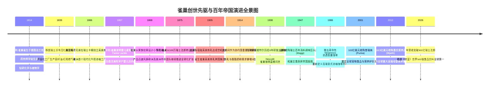
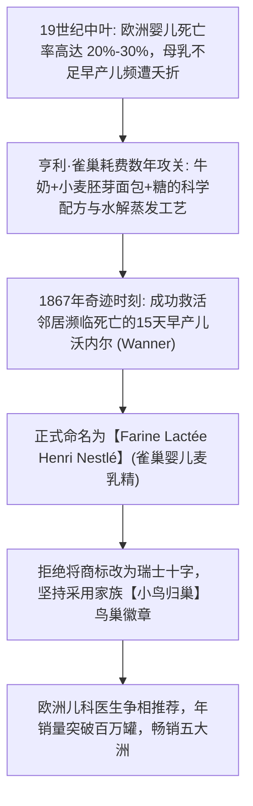
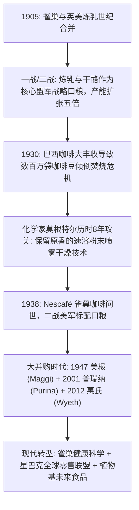

# 亨利·雀巢与佩奇兄弟：从救命麦乳精到全球食品帝国的百年创世传奇

> **“我的小鸟归巢标志不仅是一个商业商标，它是我的家族纹章，更是人类最古老也是最温暖的情感象征——母亲对幼雏无私的哺育与守护。每一个离开雀巢工厂的产品，都必须配得上这份信任。”**  
> —— 亨利·雀巢 (Henri Nestlé), 1868

---

```text
==================================================================================================
【创世先驱档案速览】
• 传主一：亨利·雀巢 (Henri Nestlé) | 原名：海因里希·内斯特勒 (Heinrich Nestle)
  • 生卒：1814 年 8 月 10 日 — 1890 年 7 月 7 日 (享年 75 岁)
  • 出生地：德国法兰克福 | 归化地：瑞士沃韦 (Vevey)
  • 核心创举：发明世界上首款工业化婴儿麦乳精 (Farine Lactée)、确立鸟巢图腾

• 传主二：查尔斯·佩奇 (Charles Page, 1838-1873) & 乔治·佩奇 (George Page, 1836-1899)
  • 出生地：美国密歇根州 / 纽约州 | 创办企业：英美炼乳公司 (Anglo-Swiss)
  • 核心创举：将美国工业化蒸汽真空浓缩炼乳技术引入欧洲，建立卡姆工厂

• 核心精神图腾：科学拯救生命、小鸟归巢母爱图腾、创造共享价值 (CSV)、百年品质守正出奇
==================================================================================================
```

---

## 🧭 全景创世历程与重大历史决断编年轴 (Chronological Epic)



---

## 🎬 第一章：法兰克福药剂师与日内瓦湖畔的发明家 (1814 — 1866)

### 1. 琉璃玻璃世家与药剂师学徒生涯
1814 年 8 月 10 日，亨利·雀巢（出生时德语名为海因里希·内斯特勒）出生在德意志自由市法兰克福一个富裕的玻璃工匠家庭。
- 父亲约翰·乌尔里希是著名的琉璃玻璃大师。在家庭的熏陶下，亨利从小对物理、化学与精密实验展现出极高天赋。
- 19 岁时，他在法兰克福一家著名药房担任药剂师学徒，跟随多位知名化学家学习药物提取、有机化学与植物营养学。

### 2. 移居瑞士沃韦与多元技术发明
- **1839 年**：25 岁的亨利由于政治动荡和对科学自由的向往，迁居至风景如画的瑞士日内瓦湖畔小镇**沃韦 (Vevey)**，并正式将德文名字 Heinrich 改为法文名字 **Henri Nestlé**。
- 在沃韦，亨利展现了一个天才发明家的跨界才能：
  - 他买下了一座磨坊和小型作坊，利用水力发明了从油菜籽中提取高纯度灯油与食油的新工艺；
  - 他发明了便携式液化气制造设备，为沃韦小镇安装了第一批公共煤气路灯；
  - 他还自建碳酸盐矿泉水生产线，研制销售富含矿物质的人工矿泉水和柠檬水。

---

## 👶 第二章：婴儿麦乳精奇迹与“小鸟归巢”图腾 (1867 — 1875)



### 1. 拯救早产儿沃内尔的奇迹诞生 (1867)
- 19 世纪中叶的欧洲，由于缺乏卫生的母乳替代品，婴儿死亡率极高（约有五分之一到三分之一的婴儿在 1 岁前因营养不良或腹泻夭折）。
- 亨利·雀巢的妻子安娜·克莱门汀是一位热心公益的慈善家，她目睹了大量贫困母亲因为无法母乳喂养而眼睁睁看着孩子死去的惨剧，极力鼓励亨利研发一种安全、营养、易消化的母乳替代食品。
- **天才的配方工艺**：亨利将新鲜的瑞士阿尔卑斯牛奶与特制烘焙后的小麦胚芽粉、糖混合，通过去除淀粉和酸性物质，利用蒸汽低温真空蒸发浓缩成极易溶解于水的干燥粉末。
- **1867 年秋天**：沃韦小镇一名仅 15 天大的早产儿**沃内尔 (Wanner)** 因母亲重病无法哺乳，婴儿生命垂危、奄奄一息，医生宣布已无力回天。
- 绝望的医生和母亲抱着最后一丝希望给沃内尔喂食了亨利试制的麦乳精。奇迹发生了：原本无法消化任何食物的婴儿开始吸收营养，体重稳步增加，最终健康存活下来。
- 这一医学奇迹迅速震动了日内瓦和巴黎的医学界，儿科医生们纷纷将雀巢麦乳精誉为“挽救婴儿生命的甘露”。

### 2. “小鸟归巢”：无法被替代的百年图腾
- 1868 年，雀巢麦乳精产能迅速扩大并远销英、法、德、美等国。
- 销售代理商建议亨利将瑞士白十字国旗作为产品标志以彰显瑞士品质，但亨利断然拒绝。他坚持使用自己家族自古传承的纹章——**一只母鸟在巢中哺育三只嗷嗷待哺的幼鸟**（德语中 "Nestle" 意为 "小鸟巢"）。
- 亨利坚定地表示：“**小鸟归巢不仅是我的姓氏，它更是大自然中最动人的母爱寓言。这个标志在任何国家、任何语言中都不需要翻译，人们一眼就能感受到爱与滋养。**”

---

## 🥛 第三章：双雄争霸与1905年世纪大合并 (1866 — 1905)

### 1. 佩奇兄弟的英美炼乳公司 (The Page Brothers)
- 就在亨利·雀巢研制麦乳精的前一年（1866 年），来自美国的兄弟**查尔斯·佩奇 (Charles Page)** 与 **乔治·佩奇 (George Page)** 来到了瑞士苏黎世附近的小镇卡姆（Cham）。
- 查尔斯曾在美国南北战争期间担任领事，他亲眼见证了博登（Gail Borden）发明的罐装浓缩炼乳如何在战场上成为挽救数十万饥渴伤员的超级军粮。
- 佩奇兄弟敏锐地发现：瑞士阿尔卑斯山拥有全球最纯净的草场和最丰沛优质的奶源，但在当时由于缺乏保鲜手段，大量夏秋季过剩的牛奶白白变质浪费。
- 佩奇兄弟创办了**英美炼乳公司 (Anglo-Swiss Condensed Milk Company)**，建立了欧洲第一座现代工业化炼乳厂，并以著名的“挤奶女工 (Milkmaid)”为商标，迅速垄断了英国本土和皇家海军的炼乳供应。

### 2. 从激烈厮杀到1905年世纪大合并
- 1875 年，61 岁且膝下无子的亨利·雀巢以 100 万瑞士法郎的高价将公司和品牌转让给沃韦当地的投资人财团，过上了安详的晚年生活（1890 年逝世）。
- 1870-1890 年代，雀巢公司与英美炼乳公司在欧洲和美洲市场展开了白热化的竞争：英美炼乳开始研制婴儿奶粉侵入雀巢腹地，而雀巢也针锋相对推出自己的炼乳品牌。
- 随着乔治·佩奇在 1899 年去世，两家公司的管理层意识到恶性价格战只会两败俱伤。
- **1905 年 4 月**：经过长达数年的艰苦谈判，两家公司宣布以 50:50 的完全平等对等方式正式合并，成立了**雀巢英美炼乳公司 (Nestlé and Anglo-Swiss Condensed Milk Company)**。合并后的新巨头在全球拥有 18 家工厂，一跃成为当时全球无可匹敌的乳品与营养霸主。

---

## ☕ 第四章：速溶咖啡革命与跨国并购巨舰 (1905 — 2026)



### 1. 莫根特尔与 8 年速溶咖啡研发壮举 (1930–1938)
- 1929 年华尔街崩盘引发全球大萧条，南美最大的咖啡生产国巴西遭遇严重的咖啡豆产能过剩。数百万袋咖啡豆堆积如山无法变现，巴西政府不得不将咖啡豆倾倒入海或当做机车燃料焚烧。
- 1930 年，巴西咖啡协会向雀巢求助，希望雀巢能像处理牛奶一样，将咖啡豆制成能够长期保存且加水即溶的固体咖啡块。
- 雀巢顶尖化学家**马克思·莫根特尔 (Max Morgenthaler)** 带领团队在沃韦实验室进行了长达 8 年数万次失败的攻关。
- **1938 年 4 月 1 日**：莫根特尔成功突破了利用碳水化合物锁香的喷雾干燥萃取工艺，划时代的**雀巢咖啡 (Nescafé)** 正式上市！在二战中，雀巢咖啡成为了盟军士兵随身携带的必备提神补给品，雀巢速溶咖啡彻底改变了全球人类的饮品消费习惯。

### 2. 百年大并购与现代营养科学巨舰
- **1947 年**：收购瑞士著名主食调味品先驱**美极 (Maggi)**，美极鲜味汁与高汤块进入全球数十亿家庭厨房。
- **1986 年**：雀巢内部孵化并推出 **Nespresso (浓遇咖啡)**，开创胶囊咖啡机与高端会员订阅服务模式。
- **2001 年**：以 103 亿美元并购美国百年宠物巨头**普瑞纳 (Purina)**，打造出全球宠物营养第一品牌冠能（Pro Plan）。
- **2012 年**：斥资 118.5 亿美元收购辉瑞旗下的**惠氏营养品 (Wyeth)**，夯实全球婴配粉第一宝座。
- **2018 年**：以 71.5 亿美元建立**星巴克全球咖啡联盟**，雀巢将星巴克咖啡胶囊与烘焙咖啡豆送入全球各大零售网络。

---

## 🧠 第五章：雀巢创世基因与商业模式工具箱

### 1. “科学解决人类刚需” (Science-Driven Necessity)
- 亨利·雀巢的发明从不是浮于表面的营销产物，而是以严谨的化学和医药科学解决“早产婴儿夭折”这一最紧迫的人类生存痛点。
- 这一基因让雀巢无论在研发速溶咖啡、特医食品还是低敏配方奶粉时，始终将研发实验室与临床医学验证置于核心驱动位置。

### 2. “多轴驱动与本地化自适应” (Decentralized Local Adaptation)
- 雀巢从不试图将一种单一的瑞士口味强加给全世界。在印度，Maggi 是国民香辣方便面；在西非，Maggi 高汤块强化了铁元素以对抗贫血；在日本，KitKat 研发了抹茶、芥末、清酒等数百种限定风味。这种极度包容的“本地化创新”是雀巢 2000 个品牌生生不息的秘诀。

---

## 💬 第六章：经典名言金句与生平大事年表

### 经典名言录 (Golden Quotes)

1. > **“优质食品，美好生活 (Good food, Good life) —— 我们的使命是提升生命质量，无论是在今天，还是在子孙后代的明天。”**
2. > **“鸟巢不仅是我的名字，它象征着爱、家庭与庇护。世界上没有任何一份商业合同，比一位母亲对我们产品的信任更加神圣。”**  
   > —— 亨利·雀巢 (Henri Nestlé)
3. > **“当大萧条把巴西的咖啡豆变成废墟时，我们看到了科学技术战胜自然周期的力量。”**  
   > —— 马克思·莫根特尔 (Max Morgenthaler, 雀巢咖啡发明人)
4. > **“真正的商业领袖必须为整个社会创造共享价值 (CSV)。如果不能让提供奶源的农户富裕起来，雀巢的工厂就无法持久运转。”**  
   > —— 保罗·薄凯 (雀巢董事长)

---

### 生平与组织大事年表 (Chronological Milestones)

| 年份 | 重大历史里程碑事件 |
| :--- | :--- |
| **1814年** | 8月10日亨利·雀巢出生于德国法兰克福，后在药房研习化学与药理学。 |
| **1839年** | 移居瑞士沃韦，开办个人工厂从事菜籽油、液化气与矿泉水技术发明。 |
| **1866年** | 佩奇兄弟在瑞士卡姆成立英美炼乳公司，开创欧洲工业化牛奶加工先河。 |
| **1867年** | 亨利·雀巢发明婴儿麦乳精 Farine Lactée，成功救治早产婴儿沃内尔，雀巢品牌诞生。 |
| **1868年** | 设计“小鸟归巢”鸟巢商标，产品迅速出口至英国、德国、法国及美洲。 |
| **1875年** | 亨利·雀巢以 100 万瑞士法郎转让公司全部股权，功成身退安享晚年。 |
| **1890年** | 亨利·雀巢在瑞士蒙特勒附近的格里永安详逝世，享年 75 岁。 |
| **1905年** | 雀巢公司与英美炼乳公司正式宣布平等合并，组建全球乳品巨头。 |
| **1938年** | 雀巢科学家莫根特尔历时 8 年研发成功速溶咖啡粉，Nescafé 雀巢咖啡全球发布。 |
| **1947年** | 并购瑞士美极（Alimentana/Maggi），将业务扩展至全球烹饪调味与汤料主食。 |
| **1986年** | 革命性高端胶囊咖啡系统 Nespresso 问世，开辟全球意式浓缩咖啡新蓝海。 |
| **2001年** | 斥资 103 亿美元收购美国普瑞纳（Purina），一举称霸全球宠物营养市场。 |
| **2012年** | 斥资 118.5 亿美元收购辉瑞旗下惠氏营养品，全面强化在亚洲等新兴市场母婴业务。 |
| **2018年** | 与星巴克结成 71.5 亿美元全球咖啡联盟，获得星巴克包装消费品永久独家零售权。 |
| **2024-2026年** | 稳居《财富》世界500强前 100 强，持续蝉联全球第一大食品饮料与营养健康跨国巨头。 |
