# 安盛集团 (AXA S.A.) —— 全球多元化保险与资产管理巨擘全景介绍

> **《财富》世界500强排名：第 94 位**  
> **企业使命：Act for human progress by protecting what matters (保护关键所在，助力人类进步)**  
> **官方网站：[www.axa.com](https://www.axa.com)**

---

## 🏢 企业基本信息 (Corporate Snapshot)

| 维度 | 详细信息 |
| :--- | :--- |
| **公司全称** | 安盛集团 (AXA S.A.) |
| **成立时间** | 源于 1817 年 (诺曼底互助社) / 1985 年由克劳德·贝贝阿正式创立 AXA 品牌 |
| **全球总部** | 🇫🇷 法国 巴黎 第八区马蒂尼翁大道25号 (25 Avenue Matignon, Paris) |
| **现代奠基人** | 克劳德·贝贝阿 (Claude Bébéar) |
| **现任董事长/CEO** | 董事长：德尼·杜威 (Denis Duverne) / 首席执行官：托马斯·布伯尔 (Thomas Buberl) |
| **股票代码** | Euronext Paris: `CS` (CAC 40 指数核心成分股) / OTC: `AXAHY` |
| **全球员工总数** | 约 14+ 万人（服务全球 50 多个国家和地区逾 9500 万客户） |
| **核心业务赛道** | 财产与意外伤害险 (P&C)、商业与特种大额风险保险 (AXA XL)、人寿与健康医疗险、全球资产管理 (AXA Investment Managers) |

---

## 🌐 核心业务矩阵与商业版图 (Business Ecosystem)

```mermaid
graph TD
    AXA["安盛全球保险与资管帝国 (AXA S.A.)"]
    
    AXA --> PC["1. 财产与意外险 (Property & Casualty)"]
    PC --> PC1["个人车险与住宅家庭财产险"]
    PC --> PC2["中小企业商业财产险与雇主责任险"]
    PC --> PC3["数字化嵌入式微保与出境旅行保障"]
    
    AXA --> XL["2. 全球特种与商业风险 (AXA XL)"]
    AXA --> XL1["航空航天、深海海运与能源化工巨灾险"]
    AXA --> XL2["网络安全险 (Cyber Insurance) & 董监事责任险 (D&O)"]
    AXA --> XL3["全球超大型再保险 (AXA XL Reinsurance)"]
    
    AXA --> LIFE["3. 人寿与健康险 (Life, Savings & Health)"]
    LIFE --> LIFE1["个人与企业员工重疾、医疗与住院津贴保障"]
    LIFE --> LIFE2["单元链接与资本保护型养老储蓄年金 (Unit-Linked)"]
    LIFE --> LIFE3["全球跨境高端医疗健康管理生态体系"]
    
    AXA --> IM["4. 资产管理 (AXA Investment Managers, AXA IM)"]
    IM --> IM1["核心固收与全球权益资产配置 (Core Fixed Income & Equities)"]
    IM --> IM2["另类资产与绿色不动产基金 (AXA IM Alts - Real Estate/Infrastructure)"]
    IM --> IM3["ESG 与可持续影响力投资 (Responsible Investing)"]

    classDef main fill:#00008f,stroke:#c41230,stroke-width:2px,color:#fff;
    classDef branch fill:#c41230,stroke:#00008f,stroke-width:1px,color:#fff;
    classDef sub fill:#f5f5f5,stroke:#00008f,stroke-width:1px,color:#000;
    class AXA main;
    class PC,XL,LIFE,IM branch;
    class PC1,PC2,PC3,XL1,XL2,XL3,LIFE1,LIFE2,LIFE3,IM1,IM2,IM3 sub;
```

---

## ⚡ 核心竞争壁垒与护城河 (Competitive Advantages)

### 1. AXA XL：全球第一大商业与特种风险承保旗舰 (Global Commercial Leader)
- 2018 年以 153 亿美元收购百慕大巨头 XL Group 后，安盛一举成为全球企业级大额特种险的绝对王者。
- 无论是在跨国卫星发射、超大型海上风电场、深水钻井平台，还是针对全球跨国企业的网络勒索攻击、复杂供应链中断险，AXA XL 拥有全球最深厚的工程精算数据库和极限风险定价权。

### 2. 精准转型的资本轻型化与抗利率周期模式 (Capital-Light Strategy)
- 过去十年中，安盛主动剥离了对低利率和金融市场波动极度敏感的传统高保证收益寿险业务（如剥离美国人寿业务 Equitable Holdings），战略聚焦于“财产险、健康险与商业特种险（P&C and Protection）”。
- 这种高周转、资本消耗极低、承保利润率高且可预测性强的“资本轻型化”业务组合，使安盛在历次全球利率风暴和股市震荡中均保持极高偿付能力充足率。

### 3. 全球资产管理与严密的可持续 ESG 整合 (AXA IM Asset Engine)
- AXA IM 管理着超过 8500 亿欧元的庞大资产，是全球最具声望的绿色责任投资先驱之一。
- 依托安盛集团的长期保费资金来源，AXA IM 在欧洲核心商业地产、生命科学园区、林业碳汇和绿色基础设施债券领域构建了极高的资产配置护城河。

---

## 📈 历史里程碑年表 (Historical Milestones)

- **1817年**：安盛的前身 **Ancienne Mutuelle de Rouen** 在法国诺曼底鲁昂创立，为当地农户提供火灾互助保险。
- **1975年**：40 岁的**克劳德·贝贝阿 (Claude Bébéar)** 出任公司最高负责人，开启了现代安盛长达数十年的跨国兼并扩张纪元。
- **1982年**：以“蛇吞象”之势成功兼并规模三倍于己的法国综合保险巨头 **Compagnie Drouot**。
- **1985年**：贝贝阿为集团正式确立了全新的全球统一品牌名称 **AXA**。
- **1991年**：跨越大西洋，以 10 亿美元斥巨资控股濒临破产危机的美国百年保险巨头**公平人寿 (The Equitable)**，成功打入全球最大保险市场。
- **1996年**：安盛完成欧洲金融史上最具震撼力的反向兼并——出资吞并规模两倍于己的法国最大国有保险巨头**巴黎联合保险公司 (UAP)**，一跃成为全球资产规模最大的保险集团。
- **1999年**：收购英国著名保险集团 **Guardian Royal Exchange (GRE)**。
- **2000年**：克劳德·贝贝阿卸任 CEO 转任监事会主席，亨利·德·卡斯特（Henri de Castries）接棒执掌。
- **2006年**：斥资 79 亿欧元收购瑞士著名保险巨头**冬日神保险 (Winterthur)**，强化欧洲大陆核心市场支配地位。
- **2018年**：以 153 亿美元现金全资收购全球特种商业险巨擘 **XL Group**，成立 AXA XL。
- **2024-2026年**：总营业收入与资产管理规模稳居全球保险业前列，持续位列《财富》世界500强百强。

---

## 🎯 企业文化与核心价值观 (Corporate Culture)

1. **保护关键所在，助力人类进步 (Act for human progress by protecting what matters)**：安盛强调保险不仅是赔付资金的池子，更是帮助人类社会抵御气候变化、地缘冲突和公共卫生危机的前沿防线。
2. **去中心化与企业家精神 (Entrepreneurial Decentralization)**：贝贝阿奠定的管理文化反对巴黎官僚主义，给予全球各区域首席执行官高度的经营自主权与损益责任。
3. **坦诚透明与风险共担**：内部倡导用精算和客观数据揭示潜在黑天鹅风险，鼓励团队敢于在动荡市场中做出逆向决策。
