# Equinor公司 (Equinor ASA) —— 挪威国家能源巨擘与全球海上风电先锋全景介绍

> **《财富》世界500强排名：第 95 位**  
> **企业定位：领先的能源转型践行者 (A broad energy company committed to long-term value)**  
> **官方网站：[www.equinor.com](https://www.equinor.com)**

---

## 🏢 企业基本信息 (Corporate Snapshot)

| 维度 | 详细信息 |
| :--- | :--- |
| **公司全称** | Equinor ASA（原挪威国家石油公司 Statoil ASA） |
| **成立时间** | 1972 年 9 月 18 日 (由挪威议会全票决议创立) |
| **全球总部** | 🇳🇴 挪威 罗加兰郡 斯塔万格 (Forusbeen 50, Stavanger) |
| **奠基先驱** | 法鲁克·阿尔-卡西姆 (Farouk Al-Kasim) & 阿恩·安杰尔 (Arve Johnsen) |
| **现任 CEO** | 安德斯·奥佩达尔 (Anders Opedal) / 董事长：乔恩·埃里克·莱因哈德森 |
| **股票代码** | OSLO: `EQNR` (挪威奥斯陆证券交易所核心基准股) / NYSE: `EQNR` |
| **股权结构** | 挪威政府（通过挪威贸易、工业与渔业部）持有 67% 绝对控股权 |
| **核心业务赛道** | 挪威大陆架深水油气勘探开采、国际油气、全球海上风电（固定式与浮式）、碳捕集与封存 (CCS)、低碳氢能与全球电力贸易 |

---

## 🌐 核心业务矩阵与商业版图 (Business Ecosystem)

```mermaid
graph TD
    EQNR["Equinor 全球能源帝国 (Equinor ASA)"]
    
    EQNR --> NCS["1. 挪威大陆架海上油气 (Exploration & Production Norway)"]
    NCS --> NCS1["超级油田群: Johan Sverdrup, Troll, Statfjord, Oseberg"]
    NCS --> NCS2["管道天然气供应: 欧洲大陆与英国最大天然气保供核心来源"]
    
    EQNR --> INT["2. 国际油气业务 (E&P International)"]
    INT --> INT1["深海超级项目: 巴西 Bacalhau 油田、美国墨西哥湾深水油气"]
    INT --> INT2["英国北海 Mariner / Rosebank 项目、加拿大海上油气"]
    
    EQNR --> REN["3. 全球海上风电与可再生能源 (Renewables)"]
    REN --> REN1["全球最大海上风电场: 英国 Dogger Bank (3.6 GW)"]
    REN --> REN2["漂浮式海上风电全球开创者: 挪威 Hywind Tampen & 苏格兰 Hywind"]
    REN --> REN3["美国帝国风电 (Empire Wind) & 欧洲陆上光伏风电"]
    
    EQNR --> LOW["4. 低碳方案与碳捕集封存 (Low Carbon Solutions)"]
    LOW --> LOW1["旗舰级二氧化碳封存工程: 极光计划 (Northern Lights CCS)"]
    LOW --> LOW2["清洁蓝氢/绿氢制造与低碳工业走廊 (H2H Saltend)"]
    
    EQNR --> MMP["5. 营销、中游与炼化 (Marketing, Midstream & Processing)"]
    MMP --> MMP1["蒙古斯塔德 (Mongstad) 大型低碳炼油厂与储运终端"]
    MMP --> MMP2["跨欧洲海底天然气管网运营与全球大宗能源量化贸易"]

    classDef main fill:#005566,stroke:#ff1243,stroke-width:2px,color:#fff;
    classDef branch fill:#ff1243,stroke:#005566,stroke-width:1px,color:#fff;
    classDef sub fill:#f5f5f5,stroke:#005566,stroke-width:1px,color:#000;
    class EQNR main;
    class NCS,INT,REN,LOW,MMP branch;
    class NCS1,NCS2,INT1,INT2,REN1,REN2,REN3,LOW1,LOW2,MMP1,MMP2 sub;
```

---

## ⚡ 核心竞争壁垒与护城河 (Competitive Advantages)

### 1. 极致的深海开采效率与全球最低开采成本 (Unrivaled Offshore Cost & Scale)
- Equinor 运营着全球最现代化的北海油气资产。其旗舰项目 **Johan Sverdrup 油田**（挪威近40年来发现的最大油田）拥有超过 27 亿桶可采储量，其单桶原油现金开采成本低于 **2 美元/桶**，满产后单日产量超 75 万桶。
- 在北海极端恶劣的海况与极寒风暴中，Equinor 掌握了世界上最顶级的海底水下生产系统（Subsea-to-Shore）与全流程无人自动化采油平台技术。

### 2. 全球最低的碳排放强度与绿色岸电系统 (World-Leading Carbon Efficiency)
- 挪威对海上平台征收极高的碳税。Equinor 率先将陆上清洁水电通过海底高压直流电缆输送至海上钻井平台（Power-from-Shore），彻底淘汰平台燃气轮机。
- Johan Sverdrup 油田每桶原油开采产生的二氧化碳排放量仅为 **0.67 公斤**，不足全球行业平均水平（15 公斤/桶）的 **1/20**，是全球碳足迹最低的特大型油田。

### 3. 欧洲能源安全的定海神针与海上风电领跑者 (Europe's Energy Anchor & Wind Pioneer)
- Equinor 承担着全欧洲三分之一以上的天然气供应，成为地缘危机中欧洲最重要的能源生命线。
- 同时，Equinor 凭借 50 年深海海上作业底蕴，开创了全球商业化**漂浮式海上风电系统 (Hywind)**，在苏格兰和挪威北海成功并网运行，牢牢占据下一代深海风电全球技术制高点。

---

## 📈 历史里程碑年表 (Historical Milestones)

- **1969年**：在挪威北海发现著名的**埃科菲斯克 (Ekofisk)** 特大油田，开启挪威石油时代。
- **1972年9月**：挪威议会全票表决通过设立国有独资的**挪威国家石油公司 (Statoil)**，阿恩·安杰尔出任首任 CEO。
- **1974-1979年**：Statoil 主导发现并成功开发世界级巨型油田 **Statfjord**，打破外国石油公司对技术的垄断。
- **1985年**：挪威政府重构石油收益分配机制，设立国家直接财务利益制度（SDFI）。
- **1990年**：挪威议会立法设立“挪威政府石油基金”（现挪威全球养老基金 GPFG，规模突破 1.6 万亿美元）。
- **2001年**：Statoil 在奥斯陆与纽约成功上市，实现 18% 股权私有化与市场化转型。
- **2007年**：Statoil 与挪威另一工业巨头**海德鲁 (Norsk Hydro)** 的油气业务正式合并。
- **2010年**：主导发现近四十年来北海最大油田 **Johan Sverdrup**。
- **2017年**：在苏格兰投运全球首个商业化浮式海上风电场 **Hywind Scotland**。
- **2018年5月**：Statoil 正式更名为 **Equinor**，标志着向涵盖石油、天然气、风能、氢能的综合能源巨头全面转型。
- **2022-2026年**：全面发挥欧洲天然气基石保供作用，Hywind Tampen 全球最大浮式风电场全容量并网，持续位列《财富》世界500强百强。

---

## 🎯 企业文化与核心价值观 (Corporate Culture)

1. **Open, Collaborative, Courageous, Caring（开放、协同、勇敢、关爱）**：将北欧平等信任文化与极其严苛的零事故海上作业安全准则融为一体。
2. **跨代财富传承与透明治理**：Equinor 赚取的绝大部分利润通过税收与分红注入挪威主权财富基金，为挪威每一位子孙后代储备永续福祉。
3. **拥抱低碳转型的战略勇气**：不惧自我颠覆，将深海油气赚取的丰厚现金流全力反哺于海上风电、碳捕集等未来前沿赛道。
