# 塔吉特公司 (Target Corporation) —— 美国平价时尚与全渠道零售巨擘全景介绍

> **《财富》世界500强排名：第 96 位**  
> **企业口号：Expect More. Pay Less. (期待更多，花费更少)**  
> **官方网站：[www.target.com](https://www.target.com)**

---

## 🏢 企业基本信息 (Corporate Snapshot)

| 维度 | 详细信息 |
| :--- | :--- |
| **公司全称** | 塔吉特公司 (Target Corporation) |
| **成立时间** | 1902 年 (戴顿百货创立) / 1962 年 5 月 1 日 (首家 Target 门店开业) |
| **全球总部** | 🇺🇸 美国 明尼苏达州 明尼阿波利斯 (Nicollet Mall, Minneapolis, MN) |
| **创始人** | 乔治·德雷珀·戴顿 (George Draper Dayton) / 现代转型开拓者：道格拉斯·戴顿 (Douglas Dayton) |
| **现任 CEO** | 布莱恩·康奈尔 (Brian Cornell) |
| **股票代码** | NYSE: `TGT` (标普500指数与标普100指数核心成分股) |
| **全美门店总数** | 约 2000 家大型商场（覆盖全美 50 个州及华盛顿特区） |
| **核心业务赛道** | 全品类精品折扣零售、生鲜食品与快消品、自有生活方式与服装品牌、全渠道即时数字零售、零售媒体网络 (Roundel) |

---

## 🌐 核心业务矩阵与商业版图 (Business Ecosystem)

```mermaid
graph TD
    TGT["塔吉特商业零售帝国 (Target Corporation)"]
    
    TGT --> STORE["1. 实体零售网络 (Physical Stores Network)"]
    STORE --> STORE1["大型综合全品类店 (Target Stores, 平均13万平方英尺)"]
    STORE --> STORE2["城市核心与大学密集型紧凑店 (Small-Format Stores)"]
    STORE --> STORE3["店中店战略生态: 苹果 Apple, 丝芙兰 Sephora, 星巴克, 迪士尼"]
    
    TGT --> BRAND["2. 独家自有品牌矩阵 (Owned Brands Portfolio)"]
    BRAND --> BRAND1["童装与母婴: Cat & Jack (年销超30亿美元) & Cloud Island"]
    BRAND --> BRAND2["家居与生活美学: Threshold, Casaluna, Pillowfort, Project 62"]
    BRAND --> BRAND3["生鲜与预制食品: Good & Gather & Favorite Day"]
    BRAND --> BRAND4["运动健身与服饰: All in Motion (年销超10亿美元) & Universal Thread"]
    
    TGT --> DIGI["3. 数字与全渠道履约 (Digital & Fulfillment)"]
    DIGI --> DIGI1["电商主站 Target.com & 移动端 App"]
    DIGI --> DIGI2["汽车后备箱免下车闪提 (Drive Up, 行业最高满意度)"]
    DIGI --> DIGI3["店内自提 (Order Pickup) & Shipt 当日即时达配送 (Same-Day Delivery)"]
    
    TGT --> ADV["4. 零售媒体与广告 (Roundel Retail Media)"]
    ADV --> ADV1["精准品牌数字赞助广告与第一方购物意图数据营销"]
    
    TGT --> LOYAL["5. 会员与金融服务 (Target Circle & Financial Services)"]
    LOYAL --> LOYAL1["Target Circle 会员生态 (超1亿忠诚用户)"]
    LOYAL --> LOYAL2["Target Circle 360 付费会员订阅 & Target Circle Card 5% 返现信用卡"]

    classDef main fill:#cc0000,stroke:#000,stroke-width:2px,color:#fff;
    classDef branch fill:#333333,stroke:#cc0000,stroke-width:1px,color:#fff;
    classDef sub fill:#f5f5f5,stroke:#cc0000,stroke-width:1px,color:#000;
    class TGT main;
    class STORE,BRAND,DIGI,ADV,LOYAL branch;
    class STORE1,STORE2,STORE3,BRAND1,BRAND2,BRAND3,BRAND4,DIGI1,DIGI2,DIGI3,ADV1,LOYAL1,LOYAL2 sub;
```

---

## ⚡ 核心竞争壁垒与护城河 (Competitive Advantages)

### 1. 独树一帜的“平价高级感 (Cheap Chic / Tar-zhay)”中产心智
- 区别于沃尔玛强调的“天天平价 (EDLP)”与低价杂货铺形象，Target 在美国消费者心中拥有独特的“Tar-zhay”（带有法式优雅发音的调侃）标签。
- Target 巧妙地将“高雅设计、宽敞明亮的购物环境、设计师联名”与“大众亲民价格”完美结合，吸引了全美平均家庭收入与受教育水平显著高于同行的年轻中产家庭客群。

### 2. “门店即微型物流枢纽 (Stores-as-Hubs)”的全渠道效率革命
- Target 拒绝耗费数百亿美元在荒野建立与门店割裂的传统远程电商大仓，而是将近 2000 家靠近城市人口稠密区的实体门店改造成兼具展示体验与最后一公里分拣履约的“微型物流中心”。
- Target 超过 **95% 的线上订单** 均直接由当地实体门店完成拣货与配送。其王牌服务 **Drive Up**（客户开车到指定车位，店员在两分钟内将打包好的商品直接放入后备箱）成为全美零售业客户满意度最高的履约模式。

### 3. 年销超 300 亿美元的高毛利独家自有品牌矩阵 (Owned Brands Power)
- Target 拥有 45 个以上高度专业化的自营品牌，其中年销售额突破 10 亿美元的超级品牌多达 10 余个（如 Cat & Jack、Threshold、Good & Gather 等）。
- 强大的自研设计与直采供应链不仅贡献了远高于代理品牌的营业利润率，更为 Target 筑起了竞争对手无法复制的排他性商品护城河。

---

## 📈 历史里程碑年表 (Historical Milestones)

- **1902年**：乔治·德雷珀·戴顿在明尼阿波利斯买下 Goodfellow 百货，后更名为 **Dayton Dry Goods Company**。
- **1946年**：戴顿百货正式确立将每年税前利润的 **5% 捐赠给当地社区** 的制度，开创美国企业慈善典范。
- **1962年5月1日**：戴顿家族第三代领袖道格拉斯·戴顿在明尼苏达州罗斯维尔开设了**第一家 Target 折扣店**，经典的红白靶心标志首次亮相。
- **1969年**：戴顿公司与密歇根州的 J.L. Hudson 联合百货合并成立 Dayton-Hudson 集团。
- **1995年**：推出首个大型综合超市业态 **SuperTarget**，引入全套生鲜烘焙与药房服务。
- **1999年**：开创性与著名建筑大师兼产品设计师迈克尔·格雷夫斯（Michael Graves）合作推出联名家居系列，开启零售业“平价高级设计”浪潮。
- **2000年**：集团正式将公司更名为 **Target Corporation**，全面聚焦 Target 品牌核心业务。
- **2014年**：布莱恩·康奈尔出任 CEO，开启数十亿美元的实体门店现代美学改造与“Stores-as-Hubs”全渠道战略。
- **2017年**：以 5.5 亿美元现金收购当日即时达配送平台 **Shipt**，彻底打通即时零售闭环。
- **2024-2026年**：总营业收入突破 1000 亿美元，Target Circle 会员人数超 1 亿，稳居《财富》世界500强百强之列。

---

## 🎯 企业文化与核心价值观 (Corporate Culture)

1. **Expect More. Pay Less.（期待更多，花费更少）**：承诺消费者无需在“商品品质与生活品位”和“实惠价格”之间做妥协。
2. **社区与社会责任（5% 承诺）**：从 1946 年至今，坚持将利润的 5% 返还给门店所在社区的教育、艺术和扶贫事业，建立极高的社区好感度。
3. **设计为所有人（Design for All）**：坚信优秀的设计不是富人的专属特权，每一件普通的浴巾、儿童 T 恤或咖啡杯都应该具备审美愉悦感。
