# 皇家阿霍德德尔海兹集团 (Koninklijke Ahold Delhaize N.V.) —— 欧美跨国食品零售巨擎全景介绍

> **《财富》世界500强排名：第 98 位**  
> **企业口号：Eat well, save time, live better (吃得更好，节省时间，生活更美)**  
> **官方网站：[www.aholddelhaize.com](https://www.aholddelhaize.com)**

---

## 🏢 企业基本信息 (Corporate Snapshot)

| 维度 | 详细信息 |
| :--- | :--- |
| **公司全称** | 皇家阿霍德德尔海兹集团 (Koninklijke Ahold Delhaize N.V.) |
| **成立时间** | 1867 年 (德尔海兹创立) / 1887 年 (Albert Heijn 创立) / 2016 年 7 月 24 日合并 |
| **全球总部** | 🇳🇱 荷兰 北荷兰省 赞丹 (Provincialeweg 11, Zaandam) |
| **创始人** | 阿尔伯特·海恩 (Albert Heijn) & 德尔海兹兄弟 (Jules, Edouard, Adolphe Delhaize) |
| **现任 CEO** | 弗兰斯·穆勒 (Frans Muller) / 董事长：彼得·阿格内菲亚尔 |
| **股票代码** | Euronext Amsterdam: `AD` (AEX指数核心成分股) / OTC: `ADRNY` |
| **全球门店总数** | 约 7700+ 家门店（遍布欧美 10 个国家，每周服务超 6000 万消费者） |
| **核心业务赛道** | 全渠道综合生鲜食品超市、便利超市、日用药妆连锁 (Etos)、酒类专卖 (Gall & Gall)、综合电商平台 (bol.com) |

---

## 🌐 核心业务矩阵与商业版图 (Business Ecosystem)

```mermaid
graph TD
    AD["皇家阿霍德德尔海兹 (Ahold Delhaize N.V.)"]
    
    AD --> US["1. 美国大型零售大区 (Ahold Delhaize USA, 贡献超60%营收)"]
    US --> US1["Food Lion (美东南高性价比超级连锁，超1100家店)"]
    US --> US2["The Giant Company & Giant Food (大华盛顿与宾州第一超市)"]
    US --> US3["The Stop & Shop Supermarket (新英格兰地区主力超市)"]
    US --> US4["Hannaford Supermarkets (美东北高品质生鲜标杆)"]
    
    AD --> EUR["2. 欧洲核心本土连锁 (European Brands Network)"]
    EUR --> EUR1["Albert Heijn (荷兰第一大国民超市，市占率超35%)"]
    EUR --> EUR2["Delhaize (比利时与卢森堡百年高端连锁)"]
    EUR --> EUR3["中东欧网络: Albert (捷克) & Mega Image (罗马尼亚) & Alfa Beta (希腊)"]
    
    AD --> BOL["3. 欧洲综合电商旗舰 (bol.com)"]
    BOL --> BOL1["荷兰与比利时第一大电商平台 (1300万+ 活跃消费者)"]
    BOL --> BOL2["第三方开放平台电商生态与极速履约网络"]
    
    AD --> SPEC["4. 专业连锁与自营品牌 (Specialty & Private Labels)"]
    SPEC --> SPEC1["健康个护药妆: Etos (荷兰第一药妆)"]
    SPEC --> SPEC2["精品酒水专卖: Gall & Gall (荷兰最大葡萄酒烈酒连锁)"]
    SPEC --> SPEC3["全品类高毛利自有品牌 (Nature's Promise, Taste of Inspirations 等)"]

    classDef main fill:#002d62,stroke:#00a3e0,stroke-width:2px,color:#fff;
    classDef branch fill:#00a3e0,stroke:#002d62,stroke-width:1px,color:#fff;
    classDef sub fill:#f5f5f5,stroke:#333,stroke-width:1px,color:#000;
    class AD main;
    class US,EUR,BOL,SPEC branch;
    class US1,US2,US3,US4,EUR1,EUR2,EUR3,BOL1,BOL2,SPEC1,SPEC2,SPEC3 sub;
```

---

## ⚡ 核心竞争壁垒与护城河 (Competitive Advantages)

### 1. 大西洋两岸极具密度的“本地第一”垄断网络 (Local Market Leadership)
- Ahold Delhaize 并不追求无序全球扩张，而是在其选定的核心市场建立无可撼动的区域密度垄断：
- 在荷兰，Albert Heijn 拥有超过 1000 家门店，占据 35% 以上的市场份额；在美国东海岸，旗下五大品牌组成了从缅因州一直延伸到佐治亚州的连贯零售走廊，是美东地区仅次于沃尔玛的第二大生鲜食品运营商。

### 2. 强大的自营品牌矩阵与生鲜供应链温控壁垒 (Private Label & Fresh Cold-chain)
- 集团自营品牌渗透率高达 **30% 以上**，拥有 Nature's Promise（有机健康）、Taste of Inspirations（高端美味）等知名自营线，贡献了极为丰厚的利润率。
- 集团建立起世界级的产地直采冷链物流网络，实现农田到货架的极致时效，生鲜损耗率远低于行业平均水平。

### 3. bol.com 带来的欧洲顶尖电商与全渠道融合优势 (Digital & Omnichannel Power)
- 旗下 bol.com 是比荷卢地区唯一的综合电商霸主（地位等同于亚马逊）。
- Ahold Delhaize 成功将数千家实体门店与 bol.com 的线上流量打通，实现店内自提、退换货与当日即时送达，构筑了纯实体零售与纯电商巨头均无法复制的双轮驱动模式。

---

## 📈 历史里程碑年表 (Historical Milestones)

- **1867年**：德尔海兹兄弟在比利时沙勒罗瓦创立连锁杂货店，采用狮子标志。
- **1887年**：21 岁的阿尔伯特·海恩在荷兰赞丹接手父亲的杂货铺，开启 Albert Heijn 品牌。
- **1948年**：Albert Heijn 在创立 60 周年之际被荷兰女王威廉明娜授予**“皇家 (Koninklijke)”**荣誉称号。
- **1952年**：Albert Heijn 在荷兰引入欧洲首家美式自助式（Self-Service）超市，颠覆柜台代销模式。
- **1977年**：Ahold 跨大西洋进军美国市场，收购 BI-LO 和 Giant Food Stores。
- **2012年**：Ahold 以 3.5 亿欧元收购荷兰第一大综合电商平台 **bol.com**。
- **2016年7月24日**：荷兰皇家阿霍德 (Ahold) 与比利时德尔海兹 (Delhaize) 完成 **290 亿美元对等合并**，诞生现代皇家阿霍德德尔海兹集团。
- **2024-2026年**：总营业收入突破 900 亿欧元，欧美全渠道即时零售与绿色低碳物流全面升级，稳居《财富》世界500强前 100 强。

---

## 🎯 企业文化与核心价值观 (Corporate Culture)

1. **Eat well, save time, live better（吃得更好，节省时间，生活更美）**：致力于让健康的有机食物成为普通家庭买得起、吃得起的日常选择。
2. **本土品牌自主与全球协同（Local Pride, Global Scale）**：尊重旗下每个百年本地品牌的独立文化与传统，在后台共享全球采购、供应链与 IT 研发中枢。
3. **可持续发展与零食品浪费**：制定严苛的可持续减碳目标，通过智能化算法预测生鲜订货，全力消除端到端的食品浪费。
