# 中国五矿集团有限公司 (China Minmetals Corporation) —— 全球金属矿产航母与冶金建设国家队全景介绍

> **《财富》世界500强排名：第 99 位**  
> **企业使命：矿业报国、矿业强国 (Serving the Nation with Metals and Minerals)**  
> **官方网站：[www.minmetals.com.cn](https://www.minmetals.com.cn)**

---

## 🏢 企业基本信息 (Corporate Snapshot)

| 维度 | 详细信息 |
| :--- | :--- |
| **公司全称** | 中国五矿集团有限公司 (China Minmetals Corporation) |
| **成立时间** | 1950 年 4 月 (中央贸易部成立中国五金电工进口公司) |
| **全球总部** | 🇨🇳 中国 北京市 海淀区三里河路5号五矿广场 |
| **企业性质** | 国务院国资委直管特大型中央企业（国有资本投资公司试点企业） |
| **现任董事长** | 翁祖亮 / 总经理：国文清 |
| **主要上市平台** | 中冶集团 (601618.SH / 01618.HK)、五矿资源 (01208.HK)、五矿资本 (600390.SH)、中钨高新 (000657.SZ)、五矿稀土等 |
| **全球员工总数** | 约 20+ 万人（海外资产遍布全球 60 多个国家和地区） |
| **核心业务赛道** | 金属矿产资源勘探与开发、冶金工程全流程建设承包 (MCC)、矿冶科技研发与高端新材料、大宗金属贸易与供应链金融 |

---

## 🌐 核心业务矩阵与商业版图 (Business Ecosystem)

```mermaid
graph TD
    MINMETALS["中国五矿集团 (China Minmetals Corporation)"]
    
    MINMETALS --> MINING["1. 全球金属矿产资源 (Mining & Resources)"]
    MINING --> MINING1["海外超级铜锌矿: 秘鲁拉斯邦巴斯 (Las Bambas)、澳大利亚杜加尔德河 (Dugald River)"]
    MINING --> MINING2["战略稀缺金属: 湖南柿竹园钨矿、中钨高新 (全球第一大硬质合金)"]
    MINING --> MINING3["新能源关键电池金属: 华友钴镍合资、五矿盐湖提锂、镍钴资源"]
    
    MINMETALS --> MCC["2. 冶金工程建设国家队 (MCC / 中冶集团)"]
    MCC --> MCC1["全球钢铁冶金工程总包 (占据全球60%以上新建冶金市场)"]
    MCC --> MCC2["城市超大型基础设施、地下综合管廊、超高层地标建筑"]
    MCC --> MCC3["绿色低碳氢冶金工艺与短流程电炉炼钢技术输出"]
    
    MINMETALS --> TECH["3. 矿冶科技与先进材料 (Tech & Advanced Materials)"]
    TECH --> TECH1["国家级科研院所: 长沙矿冶研究院、中冶赛迪、中冶京诚、中冶焦耐"]
    TECH --> TECH2["深海多金属结核采矿技术 (全球深海采矿先驱)"]
    TECH --> TECH3["正极材料 (长远锂科) & 超细晶碳化钨高端数控刀片"]
    
    MINMETALS --> COMM["4. 大宗贸易与现代金融 (Trading & Finance)"]
    COMM --> COMM1["全球大宗金属与铁矿石保供物流贸易网络"]
    COMM --> COMM2["综合金融服务: 五矿资本 (信托/证券/期货/金融租赁全牌照)"]

    classDef main fill:#003366,stroke:#e60012,stroke-width:2px,color:#fff;
    classDef branch fill:#e60012,stroke:#003366,stroke-width:1px,color:#fff;
    classDef sub fill:#f5f5f5,stroke:#333,stroke-width:1px,color:#000;
    class MINMETALS main;
    class MINING,MCC,TECH,COMM branch;
    class MINING1,MINING2,MINING3,MCC1,MCC2,MCC3,TECH1,TECH2,TECH3,COMM1,COMM2 sub;
```

---

## ⚡ 核心竞争壁垒与护城河 (Competitive Advantages)

### 1. 全球一流的海外超级矿山资产储备 (World-Class Resource Base)
- 中国五矿通过旗下港股上市公司**五矿资源 (MMG, 01208.HK)**，运营着全球前十大铜矿之一的**秘鲁拉斯邦巴斯 (Las Bambas) 铜矿**（年产铜精矿含铜逾 30-40 万吨）以及全球最高品位硬岩锌矿之一的澳大利亚杜加尔德河锌矿。
- 在战略关键金属领域，五矿掌控着全球最大的钨资源储量与深加工产能，是中国战略性关键金属供应链最核心的“压舱石”。

### 2. 中冶集团：全球第一的冶金建设独家铁军 (Unrivaled Metallurgical Construction)
- 拥有“冶金建设国家队”之称的中冶集团，是中国乃至全球最大的冶金工程承包商和冶金企业运营服务商。
- 中冶集团承担了中国近 90%、全球近 60% 的大中型钢铁冶金工程规划与建设，拥有从原料场、高炉、转炉、连铸到冷轧全流程完全自主知识产权的成套技术。

### 3. 全球罕见的“资源获取+工程设计+装备制造+采选冶炼+贸易物流”全产业链闭环
- 中国五矿是全球极少数能够将地质勘探、工程设计（中冶旗下九大国家级设计院）、矿山开采、冶金建设与全球大宗贸易融为一体的综合性矿业航母，具备极强抗击国际大宗商品周期剧烈波动的系统免疫力。

---

## 📈 历史里程碑年表 (Historical Milestones)

- **1950年4月**：中央人民政府贸易部设立**中国五金电工进口公司**，冲破西方封锁为新中国抢运建设物资。
- **1952年**：改组为中国五金机械进口公司；1960年更名为**中国五金矿产进出口总公司**。
- **1992年**：获国务院批准组建中国五矿集团，开启由外贸代理向跨国综合经营转型。
- **2009年**：斥资 13.86 亿美元收购澳大利亚 OZ Minerals 矿业核心资产，成立海外资源开发平台 **MMG (五矿资源)**。
- **2014年**：联合体斥资 **58.5 亿美元** 成功收购秘鲁 **Las Bambas 巨型铜矿**，创下中国金属矿产领域最大海外收购纪录。
- **2015年12月**：经国务院批准，**中国五矿集团与中国冶金科工集团（中冶集团）实施战略重组**，打造全球金属矿产行业航母。
- **2016-2020年**：确立“三步走、两翻番”战略目标，国有资本投资公司试点改革深入推进。
- **2024-2026年**：资产总额突破 1.1 万亿元人民币，年营业收入持续超 9000 亿元，稳居《财富》世界500强百强强列。

---

## 🎯 企业文化与核心价值观 (Corporate Culture)

1. **矿业报国、矿业强国**：始终将保障国家战略金属资源供给安全和产业链供应链自主可控作为最高政治责任与企业使命。
2. **珍惜有限，创造无限**：倡导对自然资源的最高度敬畏，通过绿色勘探、节能冶炼与循环经济，实现有限矿产资源价值的无限化。
3. **一天也不耽误，一天也不懈怠**：中冶人与五矿人传承的艰苦奋斗、雷厉风行、敢打硬仗的军工与铁军作风。
