# 中国宝武钢铁集团有限公司 (China Baowu Steel Group) —— 全球第一大钢铁航母与绿色智慧制造全景介绍

> **《财富》世界500强排名：第 100 位**  
> **企业愿景：成为全球钢铁及先进材料业引领者 (Global Leader in Steel and Advanced Materials)**  
> **官方网站：[www.baowugroup.com](https://www.baowugroup.com)**

---

## 🏢 企业基本信息 (Corporate Snapshot)

| 维度 | 详细信息 |
| :--- | :--- |
| **公司全称** | 中国宝武钢铁集团有限公司 (China Baowu Steel Group Corporation Limited) |
| **成立时间** | 1978 年 12 月 23 日 (宝钢打下第一桩) / 2016 年 9 月 (宝武联合重组) |
| **全球总部** | 🇨🇳 中国 上海市 浦东新区世博大道1859号宝武大厦 |
| **企业性质** | 国务院国资委直管中央企业、国有资本投资公司 |
| **现任董事长** | 胡望明 / 总经理：侯安贵 |
| **主要上市平台** | 宝钢股份 (600019.SH)、太钢不锈 (000825.SZ)、马钢股份 (600808.SH / 00323.HK)、宝信软件 (600845.SH)、重庆钢铁等 |
| **粗钢产量与规模** | 年产粗钢超 1.3 亿吨（连续多年蝉联全球粗钢产量第一位，“亿吨宝武”） |
| **核心业务赛道** | 普碳钢、高端不锈钢、特种合金钢与先进材料、工业互联网与软件开发 (宝信软件)、大宗电商与供应链物流 (欧冶云商)、绿色氢冶金与资源综合利用 |

---

## 🌐 核心业务矩阵与商业版图 (Business Ecosystem)

```mermaid
graph TD
    BAOWU["中国宝武钢铁航母 (China Baowu Steel Group)"]
    
    BAOWU --> STEEL["1. 钢铁全谱系制造 (Steel Manufacturing)"]
    STEEL --> STEEL1["宝钢股份 (Baosteel): 汽车板、高牌号取向硅钢、高端家电板、能源海工用钢"]
    STEEL --> STEEL2["太钢不锈 (TISCO): 全球最大不锈钢与特种钢生产基地 (笔尖钢/核电不锈钢)"]
    STEEL --> STEEL3["马钢集团 (Masteel): 轨道交通特种轮轴钢 (高铁车轮第一名) & 特殊长材"]
    STEEL --> STEEL4["武钢有限 & 中南钢铁 & 重庆钢铁: 华中与西南战略钢材腹地基石"]
    
    BAOWU --> DIGI["2. 工业互联与智慧制造 (Industrial IT & Logistics)"]
    DIGI --> DIGI1["工业软件与大数据旗舰: 宝信软件 (Baosight, 工业互联网/PLC首选)"]
    DIGI --> DIGI2["钢铁大宗电商平台: 欧冶云商 (Ouyeel, 中国最大钢铁生态交易平台)"]
    DIGI --> DIGI3["世界经济论坛灯塔工厂 (Lighthouse Factories / 5G黑灯无人钢厂)"]
    
    BAOWU --> GREEN["3. 低碳绿色氢冶金 (Green & Low-Carbon Solutions)"]
    GREEN --> GREEN1["富氢碳循环氧气高炉技术 (HyCROF, 减碳30%以上)"]
    GREEN --> GREEN2["湛江钢铁百万吨级氢基竖炉 (全氢低碳炼铁示范工程)"]
    GREEN --> GREEN3["宝武清洁能源: 工业副产氢提纯与零碳电弧炉短流程钢厂"]
    
    BAOWU --> MAT["4. 先进新材料与资源 (Advanced Materials & Resources)"]
    MAT --> MAT1["宝武碳业: 超高功率石墨电极、针状焦、高端碳纤维复合材料"]
    MAT --> MAT2["宝武资源: 西非西芒杜 (Simandou) 铁矿等全球铁矿石供应链保供"]

    classDef main fill:#002060,stroke:#e60012,stroke-width:2px,color:#fff;
    classDef branch fill:#e60012,stroke:#002060,stroke-width:1px,color:#fff;
    classDef sub fill:#f5f5f5,stroke:#333,stroke-width:1px,color:#000;
    class BAOWU main;
    class STEEL,DIGI,GREEN,MAT branch;
    class STEEL1,STEEL2,STEEL3,STEEL4,DIGI1,DIGI2,DIGI3,GREEN1,GREEN2,GREEN3,MAT1,MAT2 sub;
```

---

## ⚡ 核心竞争壁垒与护城河 (Competitive Advantages)

### 1. 全球唯一的“亿吨级”钢铁航母与绝对规模协同 (The 130 Million Ton Colossus)
- 中国宝武年粗钢产能突破 1.3 亿吨，不仅超越卢森堡安赛乐米塔尔（ArcelorMittal）成为全球第一大钢铁企业，更通过跨地域多基地协同调度，在铁矿石集中集采、海运物流与能源梯级利用上实现了全球无与伦比的规模成本优势。

### 2. 高端汽车板与顶级取向硅钢绝对排他性垄断 (High-End Products Moat)
- 宝武占据了中国汽车板 50% 以上、新能源汽车冷轧高强汽车板 60% 以上的市场份额；
- 在被誉为“钢铁皇冠上的明珠”的高牌号取向硅钢（特高压电网变压器、新能源汽车驱动电机核心磁性材料）领域，宝武掌握了完全自主知识产权的低温板坯加热制造技术，全球市场占有率第一，实现了核心工业材料的完全国产化替代。

### 3. 全球最先进的“5G+黑灯工厂”与工业软件底座 (Baosight & Lighthouse Factories)
- 旗下宝信软件研发了中国首套自主可控的大型 PLC 控制系统与工业互联网平台，宝武多处生产基地荣膺世界经济论坛（WEF）评选的全球“灯塔工厂”。在宝武的炼钢车间，工人身着西装在数公里外的中央控制室轻点鼠标，即可完成从铁水倒入、转炉吹炼到连铸出坯的千度高温全自动无人化冶炼。

---

## 📈 历史里程碑年表 (Historical Milestones)

- **1958年9月13日**：毛泽东主席亲临武汉钢铁公司，见证武钢一号高炉流出第一炉铁水。
- **1978年12月23日**：中共十一届三中全会闭幕次日，**宝钢工程在上海宝山长江之滨打下第一根钢管桩**，拉开改革开放“一号工程”序幕。
- **1979年9月**：邓小平同志视察宝钢建设工地，题写传世指示：“**历史将证明，建设宝钢是正确的。**”
- **1985年9月**：宝钢一期工程胜利建成投产，一号高炉点火成功。
- **2000年12月**：宝钢股份在上海证券交易所成功上市（600019.SH），开启中国钢铁工业现代资本市场化治理。
- **2016年9月22日**：经国务院批准，宝钢集团与武汉钢铁（集团）实施联合重组，**中国宝武钢铁集团有限公司**正式揭牌成立。
- **2019-2022年**：先后将马钢集团、太钢集团、新钢集团、重钢等纳入联合重组版图，粗钢年产量跃居 1.3 亿吨，实现“亿吨宝武”壮举，登顶全球第一。
- **2023年**：湛江钢铁全球首套百万吨级氢基竖炉顺利点火投产，开启全球钢铁绿色低碳氢冶金新纪元。
- **2024-2026年**：稳居《财富》世界500强前 100 强，主导西非西芒杜铁矿等全球资源开发，引领全球钢铁工业绿色智造转型。

---

## 🎯 企业文化与核心价值观 (Corporate Culture)

1. **钢铁报国、开放融合、严格苛求、铸就一流**：承载新中国工业化梦想与改革开放精神，对质量、技术和管理细节推行最极致的严格苛求。
2. **超越自我、敢为人先的创新精神**：从打破国外技术封锁到自主研发汽车板、硅钢、手撕钢（厚度仅 0.015 毫米），始终站在材料科技前沿。
3. **绿色低碳，生态共生**：将传统“傻大黑粗”钢厂改造为花园式滨江生态景区，率先发布行业碳达峰碳中和行动方案。
