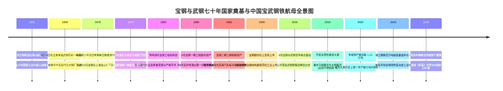
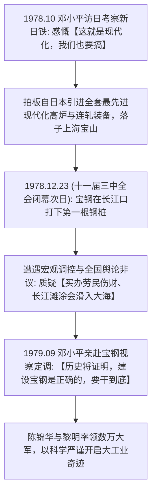
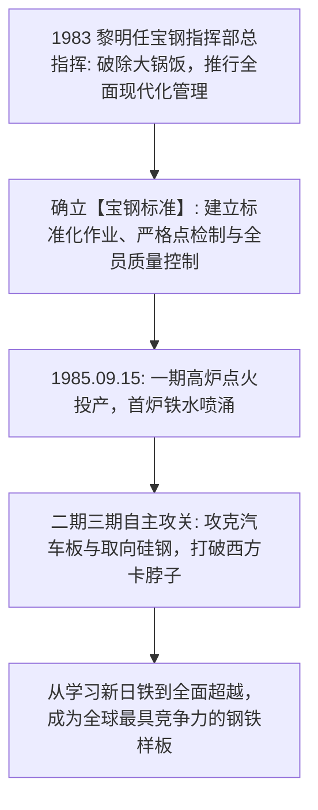
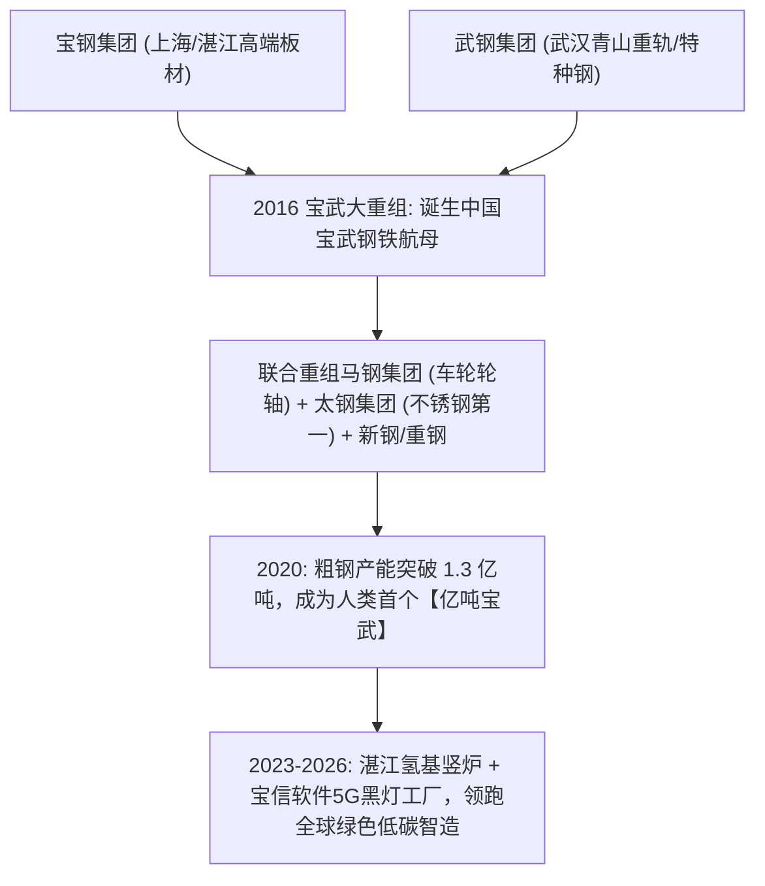

# 宝钢与武钢奠基史诗：邓小平的决断、老一辈开拓者与“亿吨宝武”传奇

> **“历史将证明，建设宝钢是正确的。我们不仅要掌握世界上最先进的钢铁制造技术，更要通过严格苛求的管理，培养出一代懂现代化大工业规律的中国建设者！”**  
> —— 邓小平 (1979) & 陈锦华、黎明 (宝钢核心奠基人)

---

```text
==================================================================================================
【奠基历史档案速览】
• 组织全称：中国宝武钢铁集团有限公司 (China Baowu Steel Group Corporation Limited)
• 历史渊源：
  1. 宝钢工程（1978年改革开放一号工程，邓小平访日后力推，投资数百亿元自日本引进新日铁现代化全套装备）
  2. 武汉钢铁（1958年毛主席剪彩一号高炉，新中国一五计划156项重点工程长子）
• 核心奠基舵手：韩英、陈锦华 (首任党委书记兼总指挥)、黎明 (原冶金部副部长/宝钢董事长兼总经理)
• 核心精神图腾：钢铁报国、严格苛求、现代化大工业管理文明、亿吨宝武兼并重组壮举
==================================================================================================
```

---

## 🧭 全景奠基历程与重大历史决断编年轴 (Chronological Epic)



---

## 🎬 第一章：青山的红色起点与毛主席的钢铁嘱托 (1952 — 1958)

### 1. 新中国“一五计划”与武汉钢铁奠基
1949 年新中国成立之初，全国钢产量仅为微不足道的 15.8 万吨，甚至不够每人打一颗铁钉。
- **1952 年**：中央决定在湖北武汉青山建立新中国第一座自行规划建设的特大型钢铁联合企业——**武汉钢铁公司 (WISCO)**。
- 数万名来自鞍钢的老师傅、部队转业官兵和青年知识分子奔赴长江中游的荒野滩涂。老一辈建设者住芦席棚、喝江水，在极度艰苦的环境中战胜了长江特大洪峰，建成了当时亚洲最宏伟的高炉与焦炉群。

### 2. 1958年9月13日：毛主席亲临剪彩一号高炉
- 1958 年 9 月 13 日，毛泽东主席专程来到武钢视察。
- 下午 3 时 25 分，毛主席登上高炉平台，炉前工撬开出铁口，金色滚烫的铁水如奔腾的蛟龙喷涌而出。毛主席凝视着铁水，高兴地向建设者们挥手致意。这一天成为了新中国工业史上最光辉的红色记忆。

---

## 🏗️ 第二章：邓小平访日、改革开放一号工程与宝山第一桩 (1978 — 1980)



### 1. 邓小平在新日铁的沉思与宝钢决策
- 1978 年 10 月，邓小平副总理访问日本。在新日铁君津制铁所，面对高度自动化、无人化的现代化炼钢生产线，邓小平深有感触地对新日铁会长稻山嘉宽说：“**这就是现代化。我们中国要实现四个现代化，就必须搞这样的现代化钢铁厂。请你们帮我们搞一个！**”
- 1978 年 12 月 23 日——正是在具有伟大历史转折意义的**中共十一届三中全会闭幕的次日**，伴随着打桩机的轰鸣，宝钢工程在上海宝山区长江入海口打下了第一根钢管桩。
- 这是新中国成立以来投资最大（一期投资超过 128 亿元人民币，相当于当时全国财政收入的十分之一）、技术最先进的特大型国家工程。

### 2. 风口浪尖与邓小平的一锤定音 (1979–1980)
- 宝钢建设开工不久，遭遇了国家国民经济调整和压缩基建投资。全国人大代表和媒体上出现了一阵质疑狂潮：
  - “为什么花这么多外汇买日本设备？这是不是崇洋媚外？”
  - “上海宝山是长江泥沙冲积层，几十万吨的重型高炉会不会沉入东海？”
  - 甚至有人联名要求宝钢工程“马上停工下马”。
- **1979 年 9 月 17 日**：邓小平同志亲自来到宝钢建设工地。他登上看台，仔细审阅地质勘探报告和工程桩基受力测试数据。在听取汇报后，邓小平站起身，掷地有声地讲出了这句传世誓言：
  > **“历史将证明，建设宝钢是正确的！第一要干，第二要干好！引进新技术之后，还要善于学习，更要善于创新！”**
- 邓小平的一锤定音，为宝钢扫清了所有阻力，挽救了这项关乎中国现代化命运的国之重器。

---

## 🎖️ 第三章：陈锦华、黎明与现代化“宝钢标准” (1981 — 1999)

### 1. 陈锦华的统帅魄力与科学求实
- 宝钢工程首任党委书记兼工程指挥部第一副总指挥**陈锦华**（后任国家体改委主任、国家计委主任），以极高的政治智慧和严密的科学态度统筹全局。
- 他顶住停工压力，通过科学论证将一期工程划分为合理的阶段，首创了大型工程项目指挥部经济责任制，确保了数百个引进子项目分毫不差地精准推进。



### 2. 黎明与“严格苛求”的管理文明
- 1983 年，原冶金工业部副部长**黎明**调任宝钢工程指挥部总指挥兼宝钢第一任总经理。黎明是一位具有极高现代工程素养的技术型领导者。
- **破除大锅饭与推行标准化作业**：
  - 黎明提出，现代钢铁工业容不得半点马虎，“一颗螺丝钉拧不到位，百万吨产线就要瘫痪”。
  - 他在宝钢全面推行“作业长制”、“设备点检定修制”与“全面质量管理体系（TQC）”，确立了闻名全国的**“严格苛求、铸就一流”的宝钢企业精神**。
- **1985 年 9 月 15 日**：宝钢一期工程胜利投产，一号高炉顺利喷涌出第一炉优质铁水。经国家验收委员会严格检测，宝钢一期工程的全部技术指标和产品质量均达到或超过了日本原厂设计水平！

### 3. 从引进吸收到自主超越：攻克汽车板与硅钢皇冠
- 投产之后，宝钢人没有止步于当外国技术的“操作工”，而是开启了波澜壮阔的自主创新：
- **高端汽车板突破**：打破欧美日对轿车高表面质量外板的垄断，成为一汽、上汽、东风乃至特斯拉、奔驰、宝马在华的核心首选供货商；
- **取向硅钢攻坚**：历经数千次实验室攻关，彻底攻克特高压电网变压器核心磁性材料取向硅钢，彻底粉碎了外国对华技术封锁。

---

## 🚢 第四章：宝武世纪大重组与“亿吨航母”全球称霸 (2016 — 2026)

### 1. 2016年宝武世纪大重组：钢铁产业供给侧改革巅峰
- 2015 年前后，中国钢铁行业遭遇严重的产能过剩与恶性竞争，全行业深陷亏损泥潭。
- 在党中央供给侧结构性改革的号角下，**2016 年 9 月 22 日**，国务院正式批准宝钢集团与武钢集团联合重组，横跨长江两岸的**中国宝武钢铁集团有限公司**正式成立。
- 重组后的宝武集团展现了惊人的整合协同效应：关停淘汰落后产能、优化沿海（湛江/宝山）与沿江（青山/马鞍山/重庆）基地布局。



### 2. “亿吨宝武”与全球兼并重组浪潮
- 2019 年重组安徽**马钢集团**（掌控高铁车轮核心技术）；
- 2020 年重组山西**太钢集团**（全球规模最大、技术最先进的不锈钢旗舰，攻克“手撕钢”）；
- 随后相继联合重组重钢、新钢、中南钢铁。
- **2020 年**：中国宝武年产粗钢突破 **1.15 亿吨**，成为人类钢铁工业史上第一个迈过“亿吨大关”的超级巨无霸，超越安赛乐米塔尔登顶全球粗钢产量第一！

### 3. 绿色氢冶金与湛江百万吨氢基竖炉
- 面对全球碳中和浪潮，宝武率先吹响了钢铁“脱碳”革命的冲锋号。
- 2023 年底，宝武在广东湛江基地投运了**全球首套百万吨级氢基竖炉示范工程**，利用清洁绿氢替代传统焦炭还原铁矿石，将炼铁过程中的碳排放强度大幅削减 80% 以上，为全球钢铁工业探索出了一条通往净零排放的可行路径。

---

## 🧠 第五章：宝武模式的底层认知与工业哲学工具箱

### 1. “现代化大工业的严格苛求法则” (The Rigor Doctrine)
- 宝钢奠基人黎明指出：农业社会的散漫习惯与现代化大工业格格不入。中国大工业的崛起，必须建立在一整套以数据为基础、以标准为准绳、以责任为终极考核的制度文明之上。

### 2. “做高端差异化不做大路货” (High-End Differentiation Moat)
- 宝武始终坚持“高端化、差异化”产品路线。宁可在低附加值普通螺纹钢上减产，也必须在汽车板、硅钢、手撕钢、耐极寒海洋工程用钢等高技术壁垒赛道保持绝对压制。

---

## 💬 第六章：经典名言金句与生平大事年表

### 经典名言录 (Golden Quotes)

1. > **“历史将证明，建设宝钢是正确的！”**  
   > —— 邓小平 (1979年9月视察宝钢工地)
2. > **“钢铁报国、开放融合、严格苛求、铸就一流。我们宝武人流淌的是滚烫的铁水，支撑的是中华民族伟大复兴的钢铁脊梁！”**
3. > **“搞现代化大工业，来不得半点虚伪和侥幸。我们必须用世界上最严苛的标准来要求自己，把每一个环节做到极致。”**  
   > —— 黎明 (宝钢核心奠基人、原董事长兼总经理)
4. > **“亿吨宝武不是终点，而是我们引领全球钢铁工业走向绿色低碳与智慧制造新时代的起点。”**  
   > —— 胡望明 (中国宝武董事长)

---

### 组织与奠基大事年表 (Chronological Milestones)

| 年份 | 重大历史里程碑事件 |
| :--- | :--- |
| **1952年** | 武汉钢铁选址青山破土动工，拉开新中国自行建设特大型钢铁联合企业大幕。 |
| **1958年9月** | 9月13日毛泽东主席亲临武钢视察，一号高炉喷涌出第一炉金色铁水。 |
| **1978年10月** | 邓小平访日考察新日铁，果断拍板自日本全套引进现代化钢铁成套设备。 |
| **1978年12月** | 12月23日（十一届三中全会闭幕次日），宝钢在上海宝山打下第一根钢桩。 |
| **1979年9月** | 邓小平视察宝钢建设工地，题词定调“历史将证明，建设宝钢是正确的”。 |
| **1983-1985年** | 陈锦华、黎明确立“严格苛求”管理体系，1985年9月宝钢一期高炉胜利投产。 |
| **1992-1998年** | 宝钢二期三期工程投产，自主攻克高等级汽车板与取向硅钢等核心材料。 |
| **2000年12月** | 宝钢股份在上海证券交易所挂牌上市（600019.SH），树立央企规范治理典范。 |
| **2016年9月** | 国务院批准宝钢集团与武钢集团联合重组，中国宝武钢铁集团正式成立。 |
| **2019-2020年** | 相继战略重组马钢集团与太钢集团，粗钢产量突破 1.15 亿吨登顶全球第一。 |
| **2023年** | 湛江钢铁百万吨级氢基竖炉顺利投产，引领全球钢铁绿色低碳氢冶金转型。 |
| **2024-2026年** | 粗钢年产量超 1.3 亿吨稳居全球第一，位列《财富》世界500强百强强列。 |
